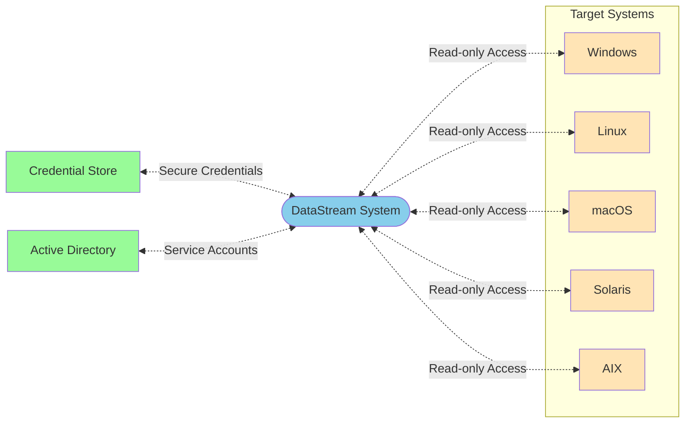
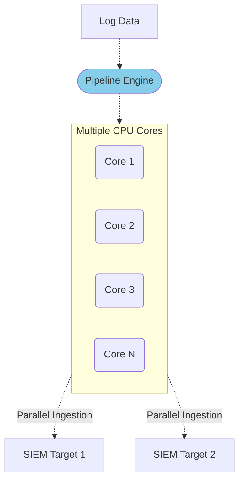
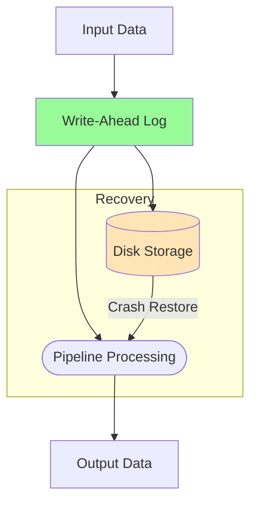
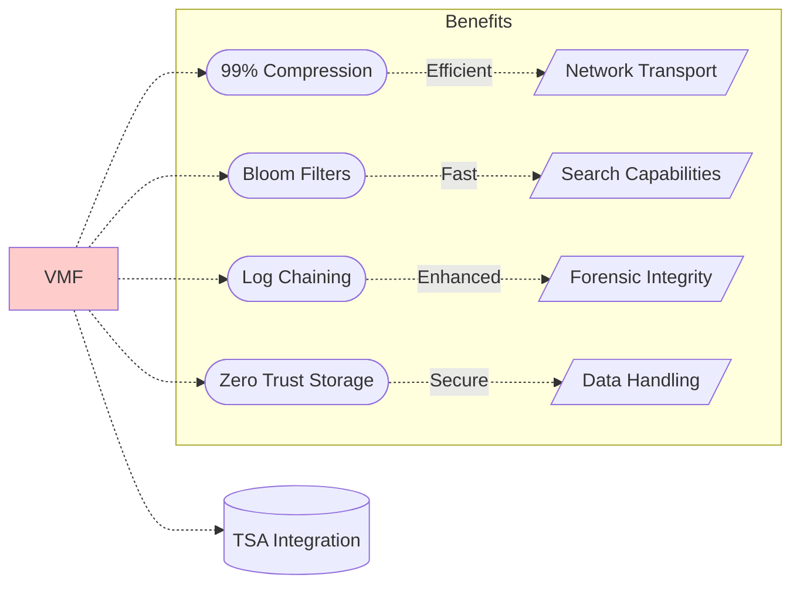
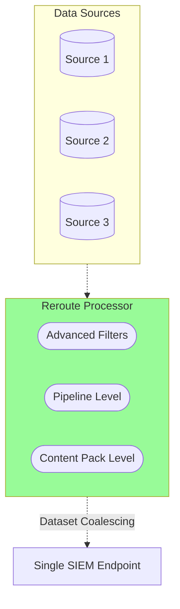
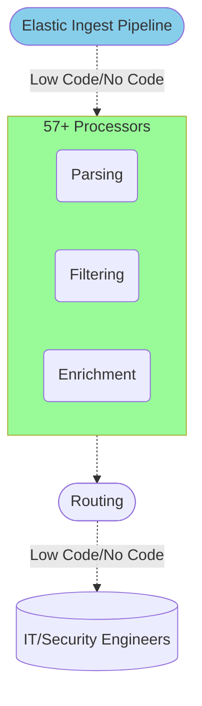
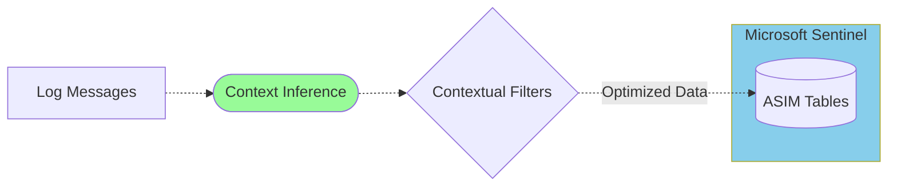

# VirtualMetric DataStream

Introducing the next-generation telemetry pipeline solution for security engineers and analysts

Designed for robust high-performance operations and granular data control

## Features

### Agentless Data Collection

**DataStream**'s agentless design enables data collection from Windows, Linux, Unix, macOS, Solaris, AIX, and many others without requiring third-party tools or complicated configurations. 

The system leverages read-only user rights for secure remote access, ensuring data integrity and compliance. By integrating with _Credential Stores_ and _Active Directory Service Accounts_, it eliminates the need for user credentials, simplifying creation of secure connections.

### Vectorized Processing Architecture

Utilizing all available cores, **DataStream**'s pipeline engine processes large log volumes in record time and provides parallel data ingestion with target SIEMs.

With over _10 times_ the ingestion speed of traditional solutions, **DataStream** reduces bandwidth usage down to the bare minimum, delivering great cost savings.

### Lossless Pipeline Engine

Our _Write-Ahead Log_ (WAL) architecture provides a robust foundation for data integrity by securely storing all routing and pipeline states on disk.

Unlike solutions that require additional components like Kafka, **DataStream** caps log duplication at just one message. This ensures zero data loss, even in the event of a crash.

The _WAL_ approach also minimizes the risk of system downtime, ensuring that your telemetry pipeline is always up and running, and consistent, even under heavy loads.

### Datasets and RBAC Structure

We are revolutionizing the traditional concept of _source_ in telemetry pipelines with our introduction of _Datasets_.

Unlike other solutions that focus solely on data collection via protocols or third-party agents, _Datasets_ categorize telemetry data&mdash;i.e. Windows Event Logs, Windows User Activity, Linux Audit Logs, etc.&mdash;at the source, simplifying pipeline design and enabling advanced _Role-Based Access Control_ (RBAC).

With _Datasets_, users can define role-based access at the data level to ensure that the teams working on the same source are fully isolated from each other. This innovative approach delivers greater flexibility and tighter security.

### Dedicated Storage Format

The _VirtualMetric File Format_ (VMF) was engineered specifically for high-performance pipeline engines.

With its roots in Apache Avro, VMF combines the efficiency of a row-based format with the ability to handle massive volumes of small data chunks. Its design enables disk-level merging without consuming system resources, overcoming the limitations of Avro OCF.

VMF achieves up to 99% compression, making it ideal for both storage and network transport. It also supports features like _Bloom Filters_, _Zero Trust Storage_, _Log Chaining_, and _TSA_ out of the box, making it the ultimate file format for fast searches, forensic integrity, and secure data handling.

### Advanced Data Routing

We have simplified data routing with our advanced `reroute` processor, eliminating the need for manual filtering that is necessary in other solutions.

This processor allows users to route data to destinations at the pipeline or content pack level. Advanced filters can be applied for precise data routing, and the _Dataset_ concept further streamlines this by enabling multiple data sources to coalesce around a single SIEM endpoint. 

Design efficient and scalable routing strategies with ease.

### Extensive Processor Support

Our pipeline engine adopts the widely recognized Elastic Ingest Pipeline format, allowing IT and Security Engineers to create and manage pipelines effortlessly.

With 57+ processors, **DataStream** has the most comprehensive support in the industry for _low-code_/_no-code_ management enabling tasks like parsing, filtering, enrichment, routing, and more. Engineers with **Elastic** experience can leverage this robust and flexible pipeline engine, reducing onboarding time and enhancing operational efficiency.

### Microsoft Sentinel Integration

The pipeline engine was specifically crafted to integrate seamlessly with Microsoft Sentinel.

By inferring context from log messages, our solution automatically ingests data into the appropriate ASIM tables, drastically reducing the manual effort and accelerating integration.

With contextual filters, users can easily optimize data ingestion to ensure only relevant information is sent to Sentinel, saving time and reducing costs by increasing efficiency.

---

Whatever your telemetry needs, **DataStream** has something to offer to make your operations more robust, secure, streamlined, and efficient at drastically reduced costs.

---
