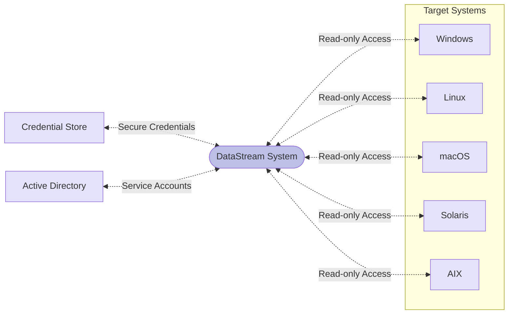
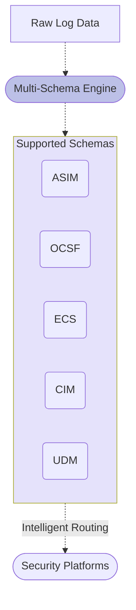
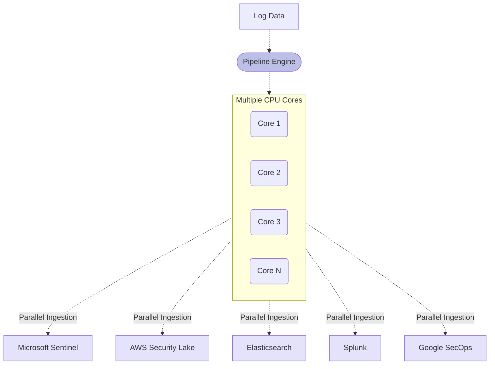
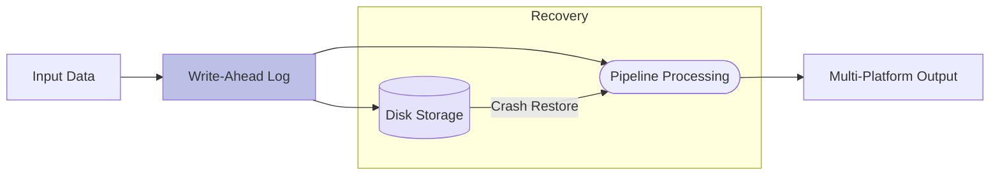
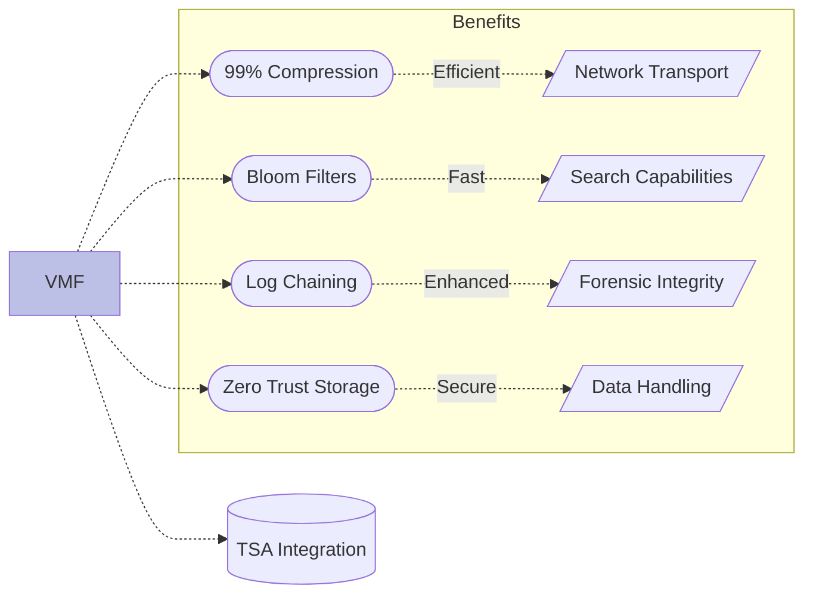
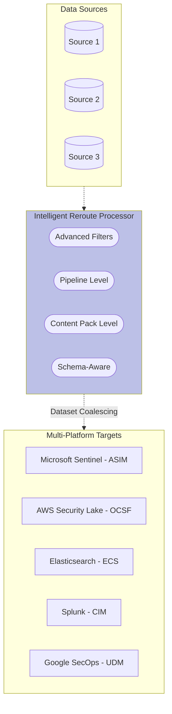
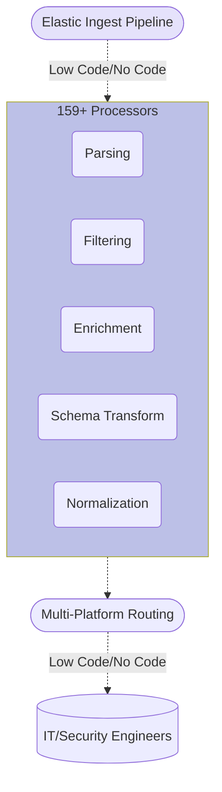
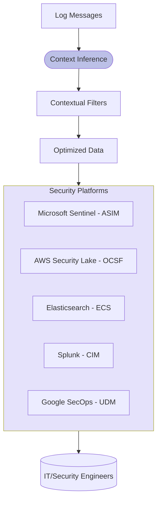

# Key Features

**VirtualMetric DataStream** offers a comprehensive range of features that make it a powerful and flexible telemetry pipeline solution for multiple security platforms including _Microsoft Sentinel_, _AWS Security Lake_, _Elasticsearch_, _Splunk Enterprise Security_, and other leading SIEM and analytics platforms. Enterprises can leverage these features to streamline their data collection, processing, and routing operations across diverse security ecosystems:

## Agentless Data Collection

**DataStream**'s agentless design enables data collection on many widely-used platforms without requiring third-party tools or complicated configurations. This significantly reduces operational overhead and eliminates common deployment challenges associated with traditional agent-based solutions.

The system operates through secure read-only connections to target systems using standard protocols. On **Windows** systems, it leverages Windows Remote Management (WinRM). On Unix-based systems including **Linux**, **macOS**, **Solaris**, and **AIX**, it utilizes SSH and native logging facilities to collect data securely.

The agentless approach also ensures that **DataStream** can begin collecting data immediately after configuration, without requiring system restarts or extensive installation management. This makes it particularly valuable for large enterprises where deploying and maintaining agents across thousands of systems is impractical.

The system leverages read-only user rights for secure remote access. By integrating with _Credential Stores_ and **Active Directory Service Accounts**, it eliminates the need for user credentials, simplifying creation of secure connections, and thereby ensuring data integrity and compliance.

Key benefits include:

* **Zero deployment overhead** - no software installation required on target systems
* **Simplified maintenance** - no agent updates or patches to manage
* **Cross-platform compatibility** - works consistently across different operating systems
* **Minimal system footprint** - uses native protocols and interfaces
* **Reduced attack surface** - operates with read-only permissions
* **Enterprise-grade security** - leverages existing authentication infrastructure

## Multi-Schema Processing Engine

**DataStream**'s advanced processing engine natively supports multiple industry-standard security schemas, enabling seamless data transformation and routing across diverse security platforms. This comprehensive schema support eliminates the complexity of managing multiple data formats and ensures consistent data quality across your entire security ecosystem.

The engine intelligently converts between schemas while preserving data integrity and semantic meaning. Field mappings are automatically applied based on schema specifications, ensuring that security context and relationships are maintained throughout the transformation process.

**DataStream** supports seamless conversion between **ASIM** (Microsoft Sentinel), **OCSF** (AWS Security Lake), **ECS** (Elasticsearch), **CIM** (Splunk), and **UDM** (Google SecOps). This native multi-schema support enables organizations to leverage multiple security platforms simultaneously while maintaining data consistency and quality.

Key capabilities include:

* **Native Schema Support** - built-in support for ASIM, OCSF, ECS, CIM schemas
* **Intelligent Field Mapping** - automatic field transformation with semantic preservation
* **Schema Validation** - ensures data quality and compliance with target schema requirements
* **Bi-directional Conversion** - seamless transformation between any supported schemas
* **Rule Enforcement** - automatic application of schema-specific validation rules
* **Context Preservation** - maintains security relationships and metadata across transformations

## Vectorized Processing Architecture

**DataStream**'s pipeline engine employs a sophisticated vectorized processing architecture that maximizes system resources by utilizing all available CPU cores. This design enables efficient processing of large log volumes and facilitates parallel data ingestion with multiple target platforms simultaneously.

The vectorized architecture breaks down incoming log streams into optimized chunks that can be processed independently across multiple cores. This parallelization ensures that system resources are used efficiently, preventing bottlenecks that commonly occur in single-threaded processing systems.

Each processing core operates independently on its assigned data chunk, performing tasks such as parsing, filtering, schema transformation, and enrichment. This parallel processing approach significantly reduces the overall processing time and enables real-time data handling even under heavy loads.

With over 10 times the ingestion speed of traditional solutions, **DataStream** reduces bandwidth usage down to the bare minimum, delivering significant cost savings. The high-performance architecture ensures that data is processed and delivered to target systems with minimal latency.

Key advantages include:

* **Maximum resource utilization** - efficiently uses all available CPU cores
* **Parallel data processing** - handles multiple data streams simultaneously
* **Multi-platform ingestion** - concurrent delivery to multiple SIEM platforms
* **Scalable performance** - processing capacity scales with available cores
* **Low latency** - minimizes delay between data collection and delivery
* **Resource optimization** - intelligent workload distribution across cores
* **Schema-aware processing** - parallel transformation to multiple target formats

## Lossless Pipeline Engine

Our _Write-Ahead Log_ (WAL) architecture provides a robust foundation for data integrity by securely storing all routing and pipeline states on disk. This architecture ensures that every piece of data is safely persisted before processing, creating a reliable recovery point in case of system failures or unexpected shutdowns.

The WAL implementation in **DataStream** operates as a high-performance buffer between data collection and processing stages. When data arrives, it is immediately written to the WAL before any processing begins, creating a durable record of all incoming information. This approach guarantees that no data is lost during pipeline processing or system transitions.

Unlike solutions that require additional components like Kafka, **DataStream** caps log duplication at just one message. This ensures zero data loss, even in the event of a crash, while maintaining efficient storage utilization. The system achieves this through a sophisticated checkpoint mechanism that tracks the processing state of each message.

The _WAL_ approach also minimizes the risk of system downtime, ensuring that your telemetry pipeline is always up and running, and consistent, even under heavy loads. When the system restarts after an interruption, it can seamlessly resume processing from the last recorded state without data loss or duplication.

Key features include:

* **Zero data loss guarantee** - all data is persisted before processing
* **Minimal message duplication** - maximum of one copy per message
* **Automatic crash recovery** - seamless resumption after system interruptions
* **State preservation** - maintains pipeline and routing states on disk
* **High throughput** - efficient write-ahead logging with minimal overhead
* **System consistency** - ensures data integrity across pipeline stages
* **Multi-platform reliability** - consistent data delivery across all target platforms

## Dedicated Storage Format

The _VirtualMetric File Format_ (VMF) was engineered specifically for high-performance pipeline engines. It represents a significant advancement in log data storage and processing, building upon the foundations of Apache Avro while addressing its limitations for telemetry data handling.

VMF combines the efficiency of a row-based format with sophisticated data organization capabilities, enabling it to handle massive volumes of small data chunks efficiently. This hybrid approach provides optimal performance for both sequential processing and random access patterns, making it uniquely suited for telemetry data management.

With its roots in Apache Avro, VMF overcomes the limitations of Avro through innovative features designed specifically for telemetry data.

Key features include:

* **Advanced Compression** - achieves up to 99% compression ratio, optimized for both storage efficiency and quick access, intelligent compression selection based on data patterns, minimal CPU overhead during compression/decompression
* **Zero Trust Storage** - end-to-end encryption of stored data, cryptographic verification of data integrity, access control integrated at the storage level, secure key management and rotation
* **Bloom Filters** - rapid search capabilities across large datasets, efficient index management, minimized false positive rates, optimized memory usage for filter operations
* **Log Chaining** - cryptographic linking of sequential log entries, tamper-evident log storage, verifiable audit trails, guaranteed log sequence integrity
* **TSA Integration** - time-stamped authority integration, certified temporal proof of log existence, compliance with regulatory requirements, non-repudiation of log timestamps

The format's design enables disk-level merging without consuming system resources, making it highly efficient for large-scale data operations. This capability is particularly valuable in high-throughput environments where traditional formats would create significant system overhead.

## Advanced Data Routing

We have simplified data routing with our advanced `reroute` processor, eliminating the need for manual filtering that is necessary in other solutions. This innovative approach transforms complex routing scenarios into manageable, automated workflows that significantly reduce operational overhead across multiple security platforms.

The reroute processor operates at multiple levels of abstraction, allowing for both broad and granular control over data flow. At the pipeline level, it handles the overall flow of data between major system components, while at the content pack level, it manages specific data transformations and routing rules for different types of content and target schemas.

This processor allows users to route data to destinations at the pipeline or content pack level with schema-aware transformations. Advanced filters can be applied for precise data routing based on content, metadata, and security context. The _Dataset_ concept further streamlines this by enabling multiple data sources to coalesce around optimal target platforms with appropriate schema formatting.

Key capabilities include:

* **Multi-level Routing Control** - pipeline-level traffic management, content pack-specific routing rules, conditional routing based on data attributes, schema-aware destination selection
* **Advanced Filtering** - complex condition evaluation, pattern matching and regular expressions, metadata-based filtering, security context-aware routing decisions
* **Schema-Aware Routing** - automatic format conversion based on destination requirements, intelligent field mapping preservation, multi-platform simultaneous delivery
* **Dataset Coalescing** - unified endpoint management across multiple platforms, intelligent data aggregation, optimized bandwidth utilization, reduced complexity

## Extensive Processor Support

Our pipeline engine adopts the widely recognized Elastic Ingest Pipeline format while extending it with comprehensive multi-schema support, allowing IT and Security Engineers to create and manage pipelines effortlessly. This adoption of a familiar standard significantly reduces the learning curve while providing powerful data processing capabilities through a comprehensive set of built-in processors.

The pipeline architecture is designed with flexibility and ease of use in mind, offering both low-code and no-code options for pipeline configuration. This approach makes it accessible to team members with varying levels of technical expertise while maintaining the power and flexibility needed for complex data processing scenarios across multiple security platforms.

Offering **159+** processors, **DataStream** has the most comprehensive support in the industry for _low-code_/_no-code_ management, enabling tasks like parsing, filtering, enrichment, schema transformation, normalization, routing, and more. Engineers with **Elastic** experience can leverage this robust and flexible pipeline engine while benefiting from extended multi-platform capabilities.

Key capabilities include:

* **Data Parsing** - structured log parsing, JSON/XML processing, CSV handling, regular expressions for extraction, custom format support
* **Schema Transformation** - native ASIM, OCSF, ECS, CIM conversion, intelligent field mapping, semantic preservation
* **Filtering Operations** - content-based filtering, metadata filtering, conditional processing, pattern matching, security context filtering
* **Data Enrichment** - metadata addition, field transformation, lookup table integration, geolocation enrichment, threat intelligence correlation
* **Advanced Processing** - data aggregation, statistical analysis, machine learning integration, complex event processing, custom script execution

## Multi-Platform Security Integration

The pipeline engine was specifically crafted to integrate seamlessly with multiple leading security platforms, providing sophisticated integration layers that understand and optimize data flow into each platform's native schema and structure. This comprehensive integration eliminates the complexity typically associated with multi-platform data ingestion and normalization.

Our integration approach focuses on intelligent context inference, automatically analyzing incoming log messages to determine their security context and optimal destination platforms. This automated classification ensures that data is properly categorized and routed to the appropriate schemas and tables without manual intervention.

By inferring context from log messages, our solution automatically routes and transforms data to appropriate platforms and schemas, drastically reducing manual effort and accelerating multi-platform integration. This intelligent mapping ensures that security events are properly normalized and enriched before reaching each platform's analytics engine.

Key features include:

* **Intelligent Context Inference** - automatic event classification, smart field mapping, metadata enrichment, relationship detection, multi-platform optimization
* **Multi-Schema Processing** - native ASIM table mapping for Microsoft Sentinel, OCSF class mapping for AWS Security Lake, ECS field mapping for Elasticsearch, CIM compliance for Splunk
* **Cost & Performance Optimization** - smart data filtering across platforms, deduplication and aggregation, volume optimization per platform, ingestion rate control
* **Unified Management** - single pipeline configuration for multiple destinations, centralized monitoring across all platforms, consistent data quality assurance

With contextual filters and intelligent routing, users can easily optimize data ingestion across multiple platforms simultaneously, ensuring only relevant information reaches each destination while maintaining comprehensive security coverage and reducing operational costs.

---

Whatever your telemetry needs across multiple security platforms, **DataStream** has something to offer to make your operations much more robust, secure, streamlined, and efficient at drastically reduced costs.

---