# SIEM Optimization

**VirtualMetric DataStream** provides comprehensive data optimization capabilities that significantly reduce storage costs and improve query performance across multiple security platforms including _Microsoft Sentinel_, _AWS Security Lake_, _Elasticsearch_, _Splunk Enterprise Security_, and _Google SecOps_. Through intelligent field-level optimization and optional event filtering, organizations can achieve 55-60% data reduction while preserving all security-critical information required for detection and response operations.

## Risk-Free Reduction Framework

**DataStream**'s Risk-Free Reduction represents a fundamentally different approach to data optimization compared to traditional telemetry pipelines. While most solutions focus on dropping entire log lines, **DataStream** focuses on removing garbage from log content, eliminating unnecessary fields while preserving complete security context. This field-level approach achieves substantial data reduction without compromising detection capabilities.

The framework is built on extensive analysis of Microsoft Sentinel content, including analytic queries, ASIM parsers, detection rules, and workbooks. For each supported vendor, VirtualMetric engineers analyze which fields are actively used by security operations and which fields contain only operational metadata or placeholder values. This analysis has been validated by external third-party security experts, confirming that only truly unnecessary data is removed.

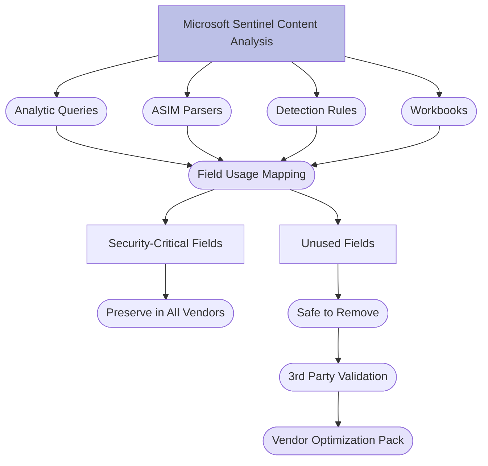

This methodology ensures zero security risk because optimization decisions are based on actual usage patterns in production security operations, not assumptions or heuristics. When Microsoft Sentinel parsers require a field for normalization or analytic rules reference a field for detection, that field is preserved regardless of its content.

Key principles include:

* **Field-level optimization** - removes unnecessary fields, not entire events
* **Content-based analysis** - decisions based on Microsoft Sentinel production usage
* **Third-party validation** - external experts verify security integrity
* **Vendor-specific intelligence** - unique optimization for each vendor's log format
* **Preservation guarantees** - all detection-relevant fields always retained
* **No AI/ML involvement** - deterministic, predictable optimization behavior

## Why VirtualMetric's Approach is Superior

**DataStream** deliberately avoids AI-based optimization techniques that other vendors promote, recognizing the fundamental incompatibility between AI unpredictability and enterprise security requirements. AI models can produce unexpected results, potentially dropping critical security events without warning. This unpredictability is unacceptable in security operations where a single missed alert could represent a major breach.

AI-based approaches introduce multiple risks that VirtualMetric's deterministic framework eliminates. AI models require training on actual log data, creating privacy and compliance concerns as sensitive security information may be learned by the model. AI processing adds significant latency and computational cost, reducing throughput and increasing infrastructure requirements. Most critically, AI decisions cannot be audited or validated, making it impossible to verify that security-relevant data is preserved.

|AI-Based Optimization (Risky)|VirtualMetric's Approach (Safe)|
|---|---|
|<ul><li>Unpredictable Results</li><li>May Drop Critical Events</li><li>Privacy Concerns</li><li>Training on Sensitive Data</li><li>Processing Latency</li><li>Increased Costs</li><li>Non-Auditable Decisions</li></ul>|<ul><li>Deterministic Rules</li><li>Guaranteed Field Preservation</li><li>No Data Learning</li><li>High Performance</li><li>Cost-Efficient</li><li>Fully Auditable</li><li>Expert Validated</li></ul>|

**DataStream**'s expert-driven approach provides predictable, consistent results that security teams can trust. Every optimization decision is based on analysis of real-world security operations, validated by experts, and documented for audit purposes. Organizations can confidently deploy aggressive optimization knowing that detection capabilities remain intact.

Advantages over AI-based optimization include:

* **Predictable behavior** - same input always produces same output
* **Zero risk of dropping critical events** - preservation rules are absolute
* **No privacy concerns** - no learning from customer data
* **Maximum performance** - no AI processing overhead
* **Lower costs** - efficient rule-based processing
* **Complete auditability** - every decision can be traced and validated
* **Enterprise trust** - deterministic systems meet compliance requirements

## Unified Optimization Strategy

**DataStream** employs a smart, centralized optimization strategy that dramatically simplifies management across multiple SIEM platforms. Rather than maintaining separate optimization logic for each target platform, the system applies vendor-specific optimization based on Microsoft Sentinel content analysis, then transforms the optimized data to target schemas in post-processing pipelines.

This approach means administrators configure optimization rules once per vendor, not once per vendor per SIEM platform. A single Fortinet optimization pack automatically reduces data volume for Sentinel, Splunk, Elasticsearch, and all other configured destinations. Changes to vendor-specific filtering rules immediately apply across the entire multi-platform deployment.

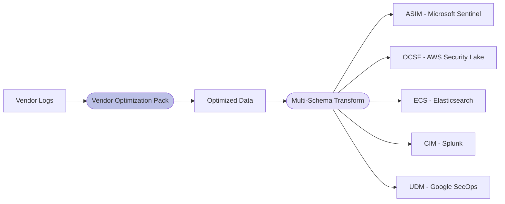

This unified strategy provides significant operational advantages. Security teams maintain a single set of optimization rules regardless of how many SIEM platforms they use. Testing and validation happens once, not repeatedly for each destination. Knowledge gained from Microsoft Sentinel content analysis automatically benefits all target platforms.

The approach works because security-relevant fields are consistent across platforms. A field that contains critical detection data for Microsoft Sentinel also contains critical data for Splunk or Elasticsearch. By optimizing based on Microsoft Sentinel's comprehensive parser and detection rule ecosystem, **DataStream** ensures security integrity across all platforms.

Benefits include:

* **Single configuration point** - one vendor pack optimizes for all destinations
* **Simplified management** - no per-platform optimization rules needed
* **Consistent behavior** - same optimization across all SIEM platforms
* **Easier validation** - test once, deploy everywhere
* **Reduced complexity** - fewer configuration files to maintain
* **Faster deployment** - single change affects all platforms
* **Knowledge leverage** - Microsoft Sentinel analysis benefits all destinations

## Vendor-Specific Optimization Packs

**DataStream** includes pre-built optimization packs for major security vendors, each developed through detailed analysis of Microsoft Sentinel parsers, analytic queries, and detection rules. These packs understand the specific log formats and field structures for each vendor, applying precise field-level optimization while guaranteeing preservation of security-relevant data.

Each vendor pack identifies which fields are actively used in security operations and which fields consistently contain placeholder values, operational metadata, or redundant information. The packs parse complex extension fields, remove unnecessary attributes, and reconstruct only the meaningful portions of each log entry.

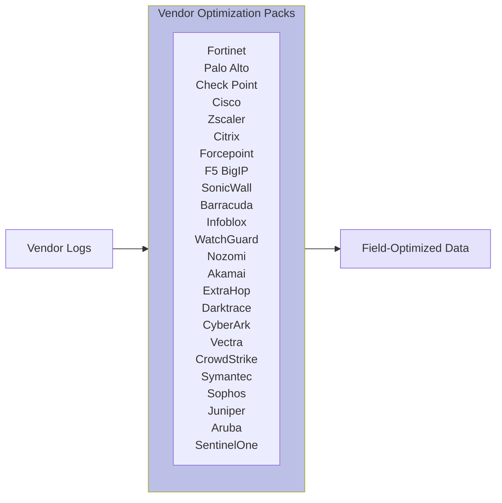

The vendor pack library is continuously expanding and includes optimization for leading security solutions across firewalls, proxies, endpoint protection, network detection and response, privileged access management, and cloud security platforms.

Supported vendor optimization packs include:

* **Network Security** - Fortinet FortiGate, Palo Alto Networks, Check Point, Cisco ASA, SonicWall, Barracuda WAF, WatchGuard, Juniper SRX
* **Secure Web Gateway** - Zscaler, Citrix NetScaler, Forcepoint
* **Application Delivery** - F5 BigIP, Citrix ADC
* **DNS Security** - Infoblox
* **Network Detection & Response** - Nozomi Networks, ExtraHop RevealX, Darktrace, Vectra
* **Cloud Security** - Akamai Edge Platform
* **Privileged Access** - CyberArk
* **Endpoint Protection** - CrowdStrike Falcon, Symantec Endpoint Protection, Sophos XG, SentinelOne
* **Network Access Control** - Aruba ClearPass

Each pack automatically activates when logs from the corresponding vendor are detected, requiring no manual configuration.

## Intelligent Field Optimization

The core of **DataStream**'s Risk-Free Reduction is intelligent field-level optimization that removes garbage from log content without eliminating security context. The **Compact Processor** automatically removes fields that provide no security value, including empty fields, null values, and common placeholder patterns found across different security vendors.

The processor recognizes standard placeholder values including numeric zeros, string placeholders, undefined values, and various representations of "no data available." By analyzing Microsoft Sentinel parsers and detection rules, VirtualMetric engineers identified which fields are never referenced in security operations, allowing safe removal even when they contain data.

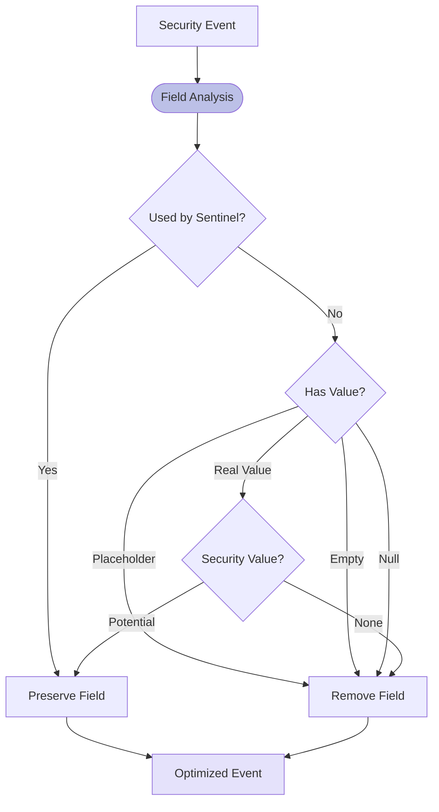

The processor supports configurable exclusion lists to preserve specific fields even when they contain placeholder values. This is essential for fields like severity levels or operation codes where a zero value carries semantic meaning and is referenced in detection logic.

Key capabilities include:

* **Microsoft Sentinel usage analysis** - preserves fields used in parsers and queries
* **Automatic placeholder detection** - recognizes vendor-specific null patterns
* **Configurable value patterns** - "0", "undefined", "0x0", "-", "N/A" and custom patterns
* **Field exclusion support** - protects fields where placeholders have meaning
* **Extension field processing** - parses and optimizes CEF/LEEF additional extensions
* **XML optimization** - processes Windows Event Log EventData efficiently
* **Recursive cleanup** - handles nested objects and arrays

## Optional Event-Level Filtering

Beyond field-level optimization, **DataStream** provides optional event-level filtering that removes entire log entries based on industry best practices and expert knowledge. These filters are **disabled by default** to ensure conservative, risk-free operation, but can be enabled when organizations want more aggressive data reduction.

Event filters are developed based on deep vendor knowledge and real-world security operations experience. VirtualMetric engineers identify specific log types, event IDs, and traffic patterns that generate high volumes but rarely contain security-relevant information. These patterns are documented and validated before inclusion in vendor packs.

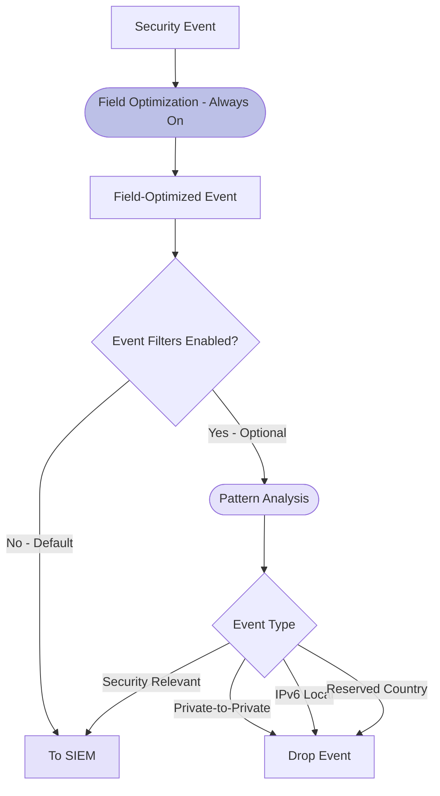

Common event filtering patterns include:

* **Private network traffic** - communications between internal private IP addresses
* **IPv6 local traffic** - link-local (fe80::) and unique local (fc00::) addresses
* **Reserved geographic regions** - traffic from unassigned country codes
* **Accepted outbound connections** - permitted traffic from internal to external
* **Specific event IDs** - vendor-specific operational events with no security value

Organizations enable event filtering after reviewing their specific environment and security requirements, understanding that aggressive filtering provides maximum cost savings while field-level optimization alone delivers substantial reduction with zero risk.

## Statistical Sampling

For organizations requiring even more aggressive data reduction, **DataStream** provides configurable statistical sampling that retains only a percentage of events matching specific criteria. Sampling is always selective, never applied to security-critical events, and users configure exactly which event types should be sampled at which rates.

The sampling engine allows different rates for different event patterns. High-volume operational traffic might be sampled at 1-in-10 while verbose debug logs are sampled at 1-in-100. Security alerts, authentication failures, and other critical events are never sampled, ensuring complete visibility into actual security incidents.

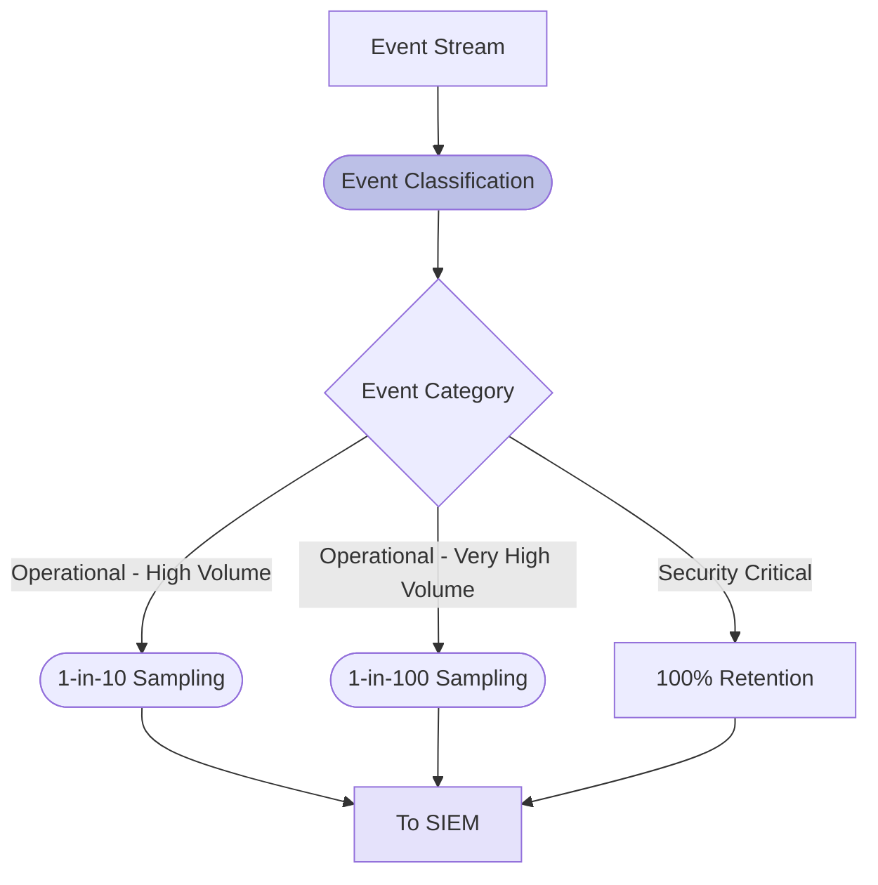

Sampling capabilities include:

* **Rule-based sampling** - different rates for different event patterns
* **Vendor-specific rules** - sampling patterns tuned per vendor
* **Configurable rates** - precise control over retention percentages
* **Security event protection** - critical events never sampled
* **Statistical validity** - maintains representative distributions
* **Deterministic behavior** - consistent, predictable sampling

## Dynamic Sampling

Beyond static sampling rates, **DataStream** supports dynamic sampling that adjusts retention rates based on current data volumes and system conditions. This advanced capability prevents data loss during unusual activity while maintaining aggressive reduction during normal operations.

Dynamic sampling monitors incoming data rates and automatically reduces sampling when volumes drop or increase retention when volumes spike. This ensures that unusual patterns, which often indicate security events, receive higher retention while routine operational traffic is aggressively reduced.

Key features include:

* **Volume-based adjustment** - responds to traffic pattern changes
* **Anomaly detection** - increases retention during unusual activity
* **Automatic rate tuning** - optimizes sampling without manual intervention
* **Threshold configuration** - defines volume levels triggering adjustments
* **Real-time response** - immediate adaptation to changing conditions

## Aggregation

For use cases where real-time delivery is not required, **DataStream** provides aggregation capabilities that combine similar events into summarized records, achieving additional data reduction. Aggregation operates on configurable time intervals, such as 1 minute or 5 minutes, grouping events by key attributes and producing statistical summaries.

Aggregation is particularly valuable for high-volume metrics, performance data, and operational telemetry where individual events provide less value than aggregate statistics. Organizations configure which event types to aggregate, which fields to group by, and what statistics to calculate.

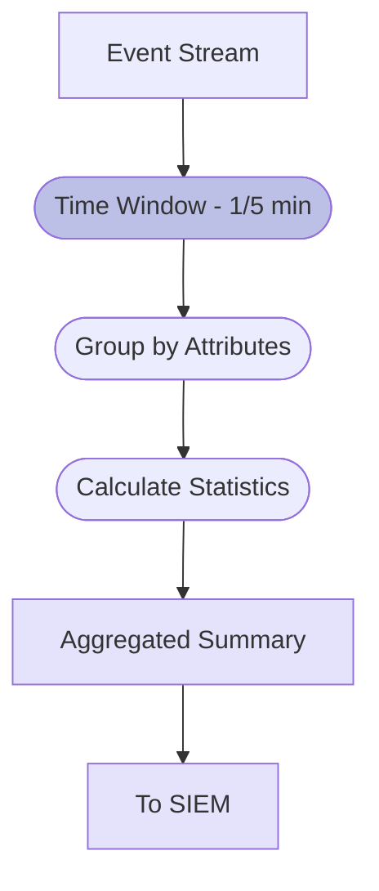

Aggregation capabilities include:

* **Time-based windowing** - configurable aggregation intervals
* **Multi-field grouping** - combine events by multiple attributes
* **Statistical functions** - count, sum, average, min, max, percentiles
* **Selective aggregation** - only specified event types aggregated
* **Metadata preservation** - maintains security context in summaries

Note that aggregation introduces latency equal to the aggregation window, making it unsuitable for real-time security monitoring. Organizations typically use aggregation for operational metrics and performance data while sending security events in real-time.

## Correlation ID and Archive Integration

**DataStream** provides a sophisticated correlation ID system that enables cost-effective long-term storage while maintaining the ability to retrieve complete original logs when needed. The system appends a unique correlation ID to each event before optimization, creating a permanent link between the optimized data in active SIEM platforms and complete raw data in archival storage.

This architecture allows organizations to send full, unoptimized logs to low-cost storage tiers like Azure Blob Storage, AWS S3, Azure Data Explorer, Google BigQuery, or Microsoft Sentinel data lake, while sending optimized, field-reduced logs to expensive active SIEM platforms. Security analysts work with optimized data for day-to-day operations but can retrieve complete original logs for forensic investigations using the correlation ID.

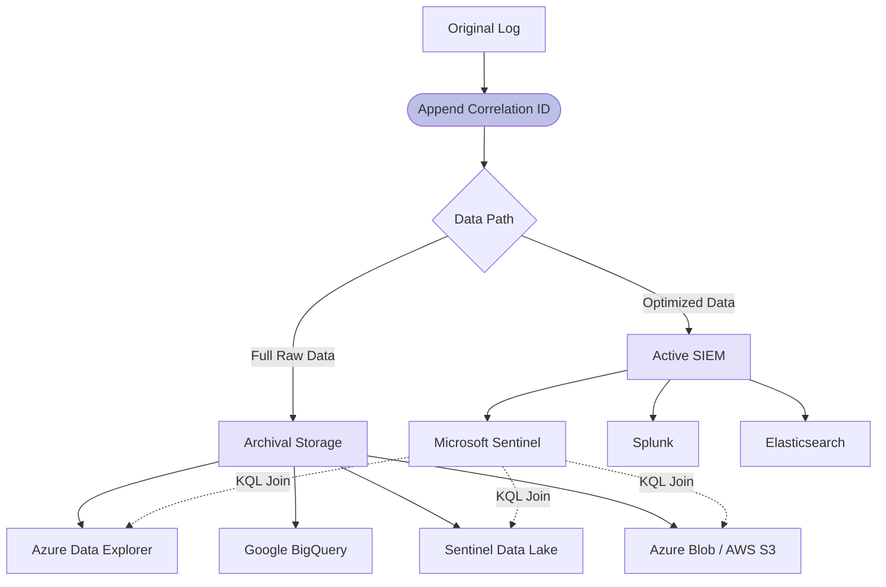

This approach is particularly powerful with Microsoft Sentinel, where KQL supports joining data across multiple sources including Sentinel workspaces, Azure Data Explorer, Sentinel data lake, and Azure Blob Storage. Analysts can query optimized data for fast, cost-effective operations, then seamlessly retrieve complete original logs when investigation requires full context.

The correlation ID system enables:

* **Dual-tier storage** - active SIEM for optimized data, archive for complete logs
* **Cost optimization** - expensive platforms store only reduced data
* **Complete forensics** - full original logs always available via correlation ID
* **Cross-platform joins** - KQL queries span multiple storage systems
* **Audit compliance** - complete logs preserved for regulatory requirements
* **Investigation flexibility** - analysts choose appropriate level of detail

The correlation ID is implemented as a unique identifier appended to each event during initial processing. This ID remains consistent across all destinations, whether the event is sent to Sentinel, ADX, Blob Storage, or multiple platforms simultaneously. When analysts identify events of interest in optimized Sentinel data, they use the correlation ID to retrieve corresponding full records from archival storage.

## Windows Event Log Optimization

Windows Security Event logs represent one of the highest volume data sources in enterprise environments. **DataStream** provides specialized optimization for Windows events that can reduce their size by 60-70% through intelligent EventData field processing while maintaining complete security visibility.

Windows events include a complex XML EventData field containing dozens of attributes, many of which contain placeholder values or operational metadata not used in security detection. VirtualMetric's analysis of Microsoft Sentinel Windows parsers and detection rules identified which EventData attributes are security-relevant and which can be safely removed.

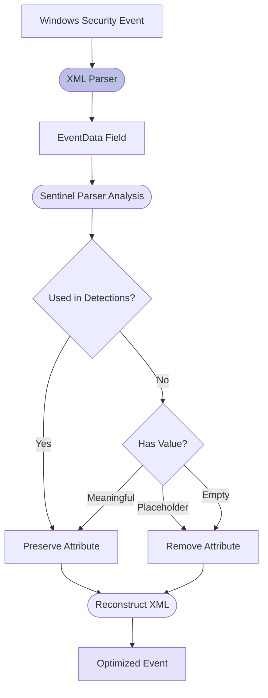

The system parses the EventData XML, analyzes each attribute against Microsoft Sentinel usage patterns, removes unnecessary attributes and placeholders, and reconstructs a minimal XML structure containing only security-relevant data. This selective processing dramatically reduces storage requirements while preserving all information used by detection rules and ASIM parsers.

Windows-specific optimizations include:

* **EventData XML parsing** - efficient processing of complex event structures
* **Sentinel parser validation** - preserves fields used in ASIM normalization
* **Default GUID removal** - strips placeholder GUIDs like 00000000-0000-0000-0000-000000000000
* **Empty attribute removal** - eliminates fields with no values
* **Placeholder filtering** - removes "0x0", "-", and vendor-specific patterns
* **Schema-aware preservation** - maintains detection-required fields
* **XML reconstruction** - creates minimal valid EventData structure
* **Level and opcode protection** - preserves operational fields where zeros matter

## Configuration and Control

All optimization features are fully configurable through the **DataStream** management interface or direct pipeline configuration. The system provides granular control over every optimization technique, from global enable/disable switches to field-level filtering rules. Default configuration emphasizes safety, with only field-level optimization enabled and event filtering disabled.

Configuration options are organized hierarchically. Master switches control broad categories of optimization while detailed settings allow fine-tuned control. This structure enables quick deployment of conservative optimization settings while providing flexibility for aggressive reduction of high-volume, low-value data sources.

```yaml
optimization:
  # Master switch for all optimization features
  status: true
  
  # Statistical sampling (disabled by default)
  use_sampling: false
  sample_rate: 10
  
  # Event-level filtering (disabled by default)
  use_event_filters: false
  
  # ASIM-aware field optimization (enabled by default)
  use_asim_filters: true
  
  # Correlation ID for archive integration
  append_correlationid: true
```

Configuration capabilities include:

* **Conservative defaults** - field optimization on, event filtering off
* **Per-vendor customization** - different rules for each vendor
* **Per-platform settings** - optimize differently for Sentinel vs Splunk
* **Sampling rate adjustment** - configurable retention percentages
* **Custom filter rules** - user-defined filtering logic
* **Field exclusion lists** - protect specific fields from optimization
* **Correlation ID control** - enable archive integration
* **Real-time updates** - changes applied without restarts

## Performance and Cost Impact

The optimization capabilities in **DataStream** deliver substantial cost savings across all supported security platforms. Real-world deployments consistently achieve 55-60% data reduction through field-level optimization alone, with aggressive configurations reaching 70-80% reduction when combining field optimization, event filtering, sampling, and aggregation.

Beyond direct storage cost savings, optimization improves query performance by reducing the amount of data that analytics engines must process. Faster queries mean more responsive security operations, reduced infrastructure requirements, and better experience for security analysts.

```mermaid
graph LR
    Before[100% Raw Data]
    Field[40-45% Field Optimized]
    Event[30-40% Event Filtered]
    Sample[20-30% Sampled]
    
    Before -->|Field Optimization| Field
    Field -->|Event Filtering| Event
    Event -->|Sampling| Sample
    
    subgraph Impact[Cost & Performance Impact]
        Storage[55-80% Storage Savings]
        Query[2-3x Query Performance]
        Network[60-70% Network Reduction]
        Cost[50-80% Cost Reduction]
    end
    
    Sample --> Impact
    
    style Before fill:#E5E2FB
    style Field fill:#BCC0E7
    style Event fill:#BCC0E7
    style Sample fill:#BCC0E7
    style Impact fill:#E5E2FB
```

Measured benefits include:

* **Storage cost reduction** - 55-60% with field optimization, 70-80% with full optimization
* **Query performance improvement** - 2-3x faster analytics queries
* **Network bandwidth savings** - 60-70% reduction in data transmission
* **Infrastructure optimization** - reduced processing and indexing overhead
* **License optimization** - lower per-GB licensing costs
* **Operational efficiency** - faster incident investigation and response

The correlation ID system provides additional cost benefits by enabling tiered storage strategies. Organizations can maintain expensive active SIEM platforms at 40-50% of original data volume while archiving complete logs to storage costing 90% less per GB.

## Security and Compliance Considerations

All optimization techniques in **DataStream** are designed with security and compliance requirements as primary considerations. The field-level optimization approach based on Microsoft Sentinel content analysis ensures that no security-relevant data is eliminated. External third-party validation confirms the integrity of optimization decisions.

For regulated environments, the correlation ID system enables compliance with data retention mandates while still achieving substantial cost savings. Complete original logs remain available in archival storage while optimized data serves day-to-day security operations. This satisfies regulatory requirements for log retention while optimizing costs for active analysis.

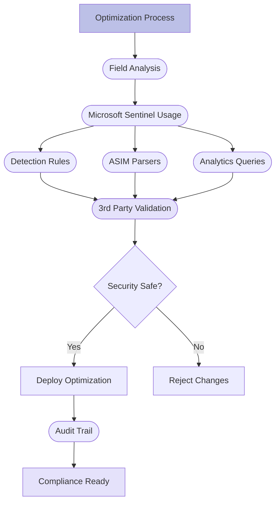

Key security and compliance features include:

* **Third-party validation** - external experts verify optimization safety
* **Deterministic behavior** - no AI unpredictability
* **Complete audit trail** - logging of all optimization decisions
* **Compliance mode** - pre-configured settings for regulatory requirements
* **Field protection** - guaranteed preservation of detection-relevant data
* **Archive integration** - complete logs preserved via correlation ID
* **Risk assessment reporting** - validation of optimization security impact
* **No sensitive data exposure** - no AI training on customer logs

---

<div className="about-byline">
**DataStream**'s comprehensive optimization capabilities enable organizations to achieve dramatic cost savings across multiple security platforms while maintaining complete security visibility and compliance with regulatory requirements. The Risk-Free Reduction framework based on Microsoft Sentinel content analysis ensures that cost optimization never compromises security effectiveness, while the unified optimization strategy simplifies management across diverse SIEM deployments.
</div>

---