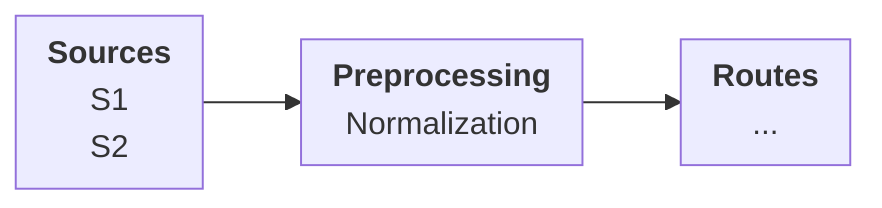
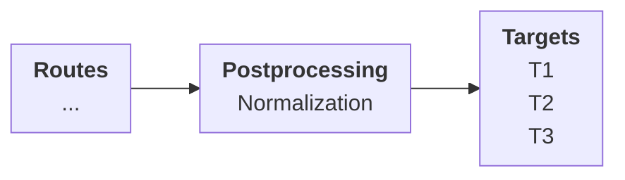

# Normalization

Normalization is the stage where data points are prepared for a consumer. This is the phase of transforming the structure of the data&mdash;whether it is what is received from sources or what will be directed to destinations&mdash;in order to make it fit for processing downstream.

The primary tool for this process is once again pipelines.

Normalization takes place in two places:

* between _Sources_ and _Routes_: the purpose here is to prepare the data points for the _Routes_ that will select the relevant data points based on their filters

* between _Routes_ and _Targets_: the purpose here is to relay the data points for the post-procesing stage where they are prepared for specific _Targets_

Normalization decouples _Sources_ from _Routes_ and _Routes_ from _Targets_ because:

- the raw data streamed from _Sources_ in the format it arrives may not, and frequently does not, lend itself to the operations that will be carried out by the _Routes_
- the processed data streamed from the _Routes_ may not be, and frequently is not, easily consumable by the _Targets_, at least given their analytic requirements

{/* TODO: Complete */}
