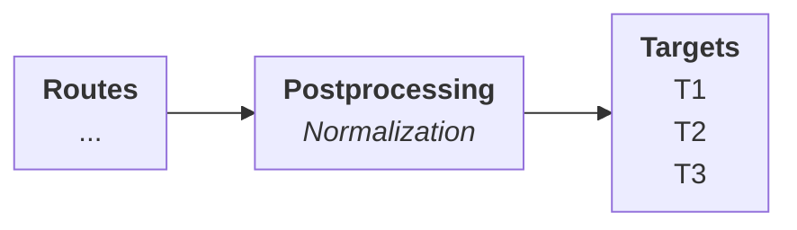

# Normalization

Normalization is the process of transforming the _structure_ of the data&mdash;whether that data is what is received from sources or what will be directed to destinations&mdash;in order to make it fit for processing downstream.

The motivation behind this is the fact that there are various different logging formats available whose schemas are not always compatible with each other. In order to be able to collate and correlate the information in these disparate formats, the data contained therein must be extracted and placed in pre-defined schemas better suited to analyses.

By doing so, normalization _decouples_ **Sources** from **Routes** and **Routes** from **Targets** due to the following reasons:

- the raw data streamed in from **Sources** in the format it arrives may not, and frequently does not, lend itself to the operations that may be carried out by the **Routes**
- the processed data streamed out from the **Routes** may not be, and frequently is not, easily consumable by the **Targets** for their analytic requirements

Normalization takes place in two places:

* Between **Sources** and **Routes**: the purpose of use is to prepare the data for the **Routes** that will select the relevant data points using filters

* Between **Routes** and **Targets**: the purpose of use is to prepare the data points for the post-procesing stage where they are relayed to specific **Targets**

Although what is referred to as _Normalization_ occurs in both intermediate stages, the operations carried out in each are different due to the requirements of the next stage in the chain.

{/* TODO: Complete */}