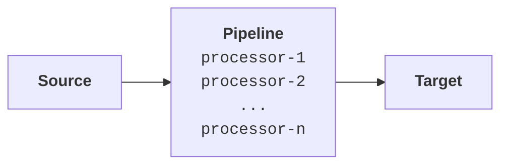

# Pipeline Overview

**VirtualMetric** pipelines were designed to automate your processes dealing with data ingestion and transformation. They can be used to extract values, transform or convert them, enrich them by correlating them with available information, and design the overall workflow of your data stream.

Pipelines are chains of [processors](./processors) that run sequentially, operating on the data in the incoming doccuments from [sources](source.mdx). When they are completed they are routed to [targets](target.mdx) for consumption.

The primary purpose of pipelines is using _division of labor_ to simplify telemetry.

Let us illustrate.

## Raw Data Streams
