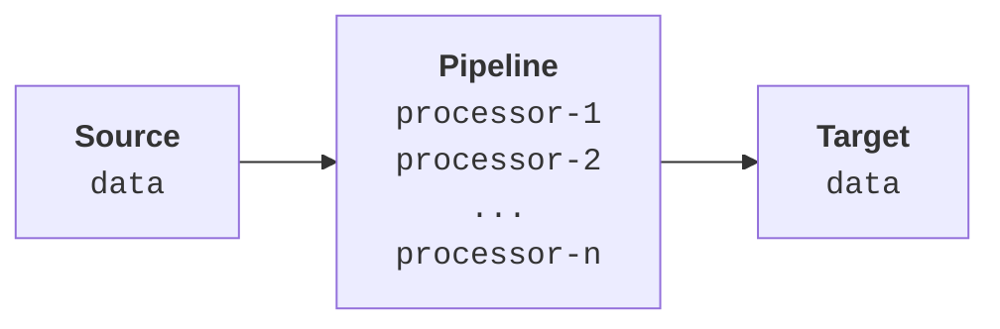
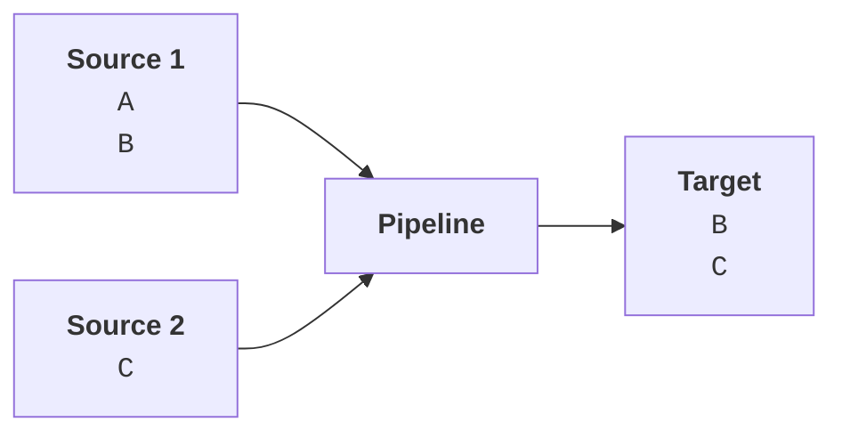
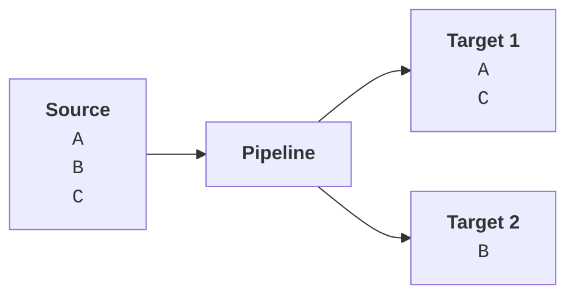
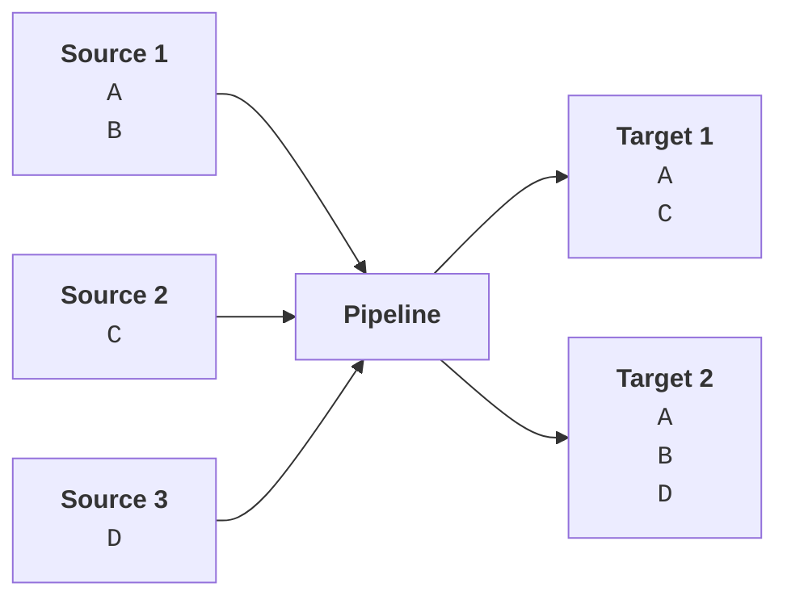

# Pipeline Overview

**Director** pipelines were designed to automate your processes dealing with data ingestion and transformation. They can be used to extract values, transform or convert them, enrich them by correlating them with other available information, and design the overall workflow of your telemetry data processing scheme.

## Definitions

Pipelines are chains of [processors](./processors) that run sequentially, operating on the incoming data streamed from [sources](source.mdx), and roting their output to [targets](target.mdx) for consumption or further processing.

Schematically, this looks like so:



As can be expected, in real life scenarious the configurations connecting sources to targets will vary based on the requirements of the various actors.

## Configurations

A pipeline can consume data from multiple sources, and once it's done processing them, can direct some of the processed data items to a specific target in a _one-to-one_ scheme:



It can also consume data from a single source and deliver the processed results to multiple targets:



Finally, and in most real-life situations, we will have multiple sources and multiple targets routed to each other in complex arrangements:



Effectively, each source may be the target of an upstream pipeline, and each target may serve as the source for a downstream one. The detail to keep in mind is that each **Source** side is delegating some processing to the next pipeline based on some established requirements of the **Target** side. The pipeline is acting as the middleman for the data interchange. Even if it routes _some_ data items without any processing, this should be due to the demands of the **Target** side, so the pipeline is performing a meaningful role by at least fulfilling a configured routing policy.

The purpose of these simple illustrations is to emphasize the underlying logic of this arrangement: the primary purpose of pipelines is using _division of labor_ to simplify telemetry.

Let us illustrate.

## Data Streams

In any telemetry operation, the incoming raw data streams will naturally have their own structure. This structure, however, may not&mdash;and frequently _does not_&mdash;lend itself to use for specific purposes, such as analysis or transformation. Trying to do so would be time consuming, processor-intensive, and possibly error prone. Therefore, it is unwise to implement a _curating_ strategy on the _Source_ side, i.e. where the data originates. And that is exactly where pipelines enter the picture.

## Divide and Rule

A pipeline is essentially based on the principle of _divide-and-rule_: divide the operations to be performed on the available data into the smallest meaningful and coherent actions, sequence them in a logical order based on the expected _inputs_ and the generated _outputs_, and run them as a chain.

The basic layout of the configuration for a typical pipeline looks like so:

```json
{
  "description": "Explanatory note for the pipeline",
  "processors": [
    {
      "processor-1": {
        "field": "foo",
        "value": "A"
      }
    },
    {
      "processor-2": {
        "description": "Explanatory note for processor-2",
        "field": "bar",
        "value": true
      }
    },
    {
      "processor-3": {
        "field": "baz",
        "value": 10
      }
    }
  ]
}
```

This pipeline is created based on the assumption that the incoming data stream will have the following structure:

```json
{
   "data": [
      "foo": ["A", "B", "C", ...],
      "baz": [5, 10, 1, ...],
      "bar": true,
   ]
}
```

Note that the pipeline definition contains a mixture of _required_ and _optional_ fields, and that&mdash;in this form&mdash;it disregards the order of fields in the source data. All that it cares about is

* that the enumerated fields exist, and
* that they contain the expected types of data

## Simplified Functionality

Let us point out here that the above pipeline may appear incomplete: it does _not_ explicitly specify what will happen to the selected values when the processors are run. Assume that, after this pipeline has been run, the data appears like so:

```json
{
   "docs": [
      "doc": {
         "foo": ["Z", "B", "C", ...],
         "baz": [5, 100, 1, ...],
         "bar": true,
      }
   ]
}
```

A brief glance will indicate that the value `A` in `foo` has become `Z`, that the `10` in `baz` has become `100`, whereas `bar` is left untouched since it was already `true`.

Although the pipeline appears underspecified, the example is intended to illustrate that what a sequence of processors does is as simple as this. Each performs a single operation on a specific field, and that is the pipeline's power. Once the incoming data is [normalized](../misc/normalization.mdx)&mdash;i.e. converted into a structure making it easy to extract data items from it&mdash; it becomes very easy to curate, transform, and enrich its values into a desirable form on the fly.

Let us now explain the concepts of _curation_, _transformation_, and _enrichment_ a bit further.

## Transforming Data

As we have said earlier, the incoming raw data streams will have their own structure. As such, they will at best be partially suitable for analysis and, therefore, decision making. In its raw form, data is frequently not&mdash;at least may not be&mdash;what it seems to be. It has to be normalized and sifted through.

The process of selecting or filtering data based on specific criteria is called _curation_. This involves checking whether a field's value matches or contains specific values or fragments of values.

After this is done, the selected data may need to be converted into forms making them more suitable for analysis and consumption. This second phase is called _transformation_.

Finally, the data may contain hints or fragments of information which, when correlated with other available data, may yield insights that may be required for analysis and use. The process of adding correlated information in order to render the data more relevant&mdash;or increase its relevance&mdash;is known as _enrichment_.

It is at this three-fold stage that a pipeline truly shines and becomes indispensible.

---

In the chapters below, you will find a palette of processors designed to meet your needs for creating efficient pipelines.
