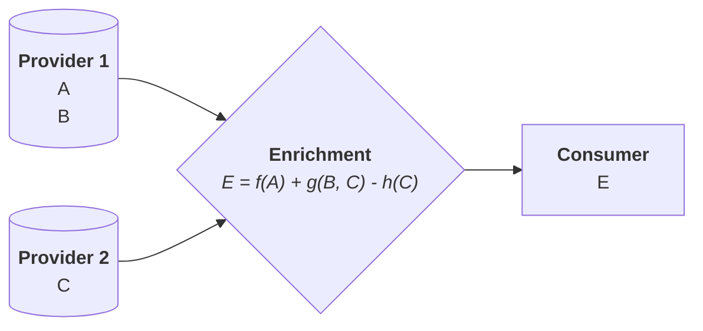

# Enrich

## Synopsis

```yaml {2-4}
enrich:
   - dataset_name: <string>
   - lookup_table: <ident>
   - query: <script>
   - description: <string>
   - if: <script>
   - ignore_failure: <logical>
   - ignore_missing: <logical>
   - on_failure: <processors...>
   - on_success: <processors...>
   - override: <logical>
   - tag: <string>
```

## Description

**Functionality**: Enriches data with data from another source.

This involves correlating data items to increase their semantic depth and relevance for the target. A typical example would be to grab the IP of a Website user, look up the IP range from a _geolocation_ database, and infer what _geographical region_ the user is in.

Schematically:



## Parameters

|Field|Required|Default|Description|
|---|---|---|---|
|`dataset_name`|Y|N/A|Field containing the dataset to be used for enrichment|
|`lookup_table`|Y|N/A|Field containing the table to be used to correlate with dataset|
|`query`|Y|N/A|Criteria to use against `lookup_table`|
|`description`|N|-|Explanatory note|
|`if`|N|-|Condition to run|
|`ignore_failure`|N|`false`|See [Handling Failures](../handling-failures.mdx)|
|`ignore_missing`|N|`false`|If `true` and `field` does not exist or is `null`, exit quietly without making any modifications|
|`on_failure`|N|-|See [Handling Failures](../handling-failures.mdx)|
|`on_success`|N|-|See [Handling Success](../handling-success.mdx)|
|`override`|N|`true`|Update fields with pre-existing values. If `false`, those fields are not touched|
|`tag`|N|-|Identifier|

## Examples

{/* FIXME: Provide examples */}
