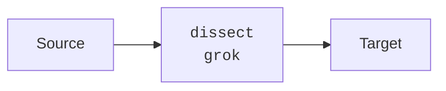

# Enrich

<Synopsis>
Enriches data with data from another source.
</Synopsis>

TODO: Complete schematics, graphics, and explanation

## Parameters

TODO: Complete parameters

|Field|Required|Default|Description|
|---|---|---|---|
|`dataset_name`|Y|N/A||
|`lookup_table`|Y|N/A||
|`query`|Y|N/A||
|`description`|N|-|Explanatory note|
|`if`|N|-|Condition to run|
|`ignore_failure`|N|`false`|See [Handling Failures](../handling-failures.mdx)|
|`ignore_missing`|N|`false`|If `true` and `field` does not exist or is `null`, exit quietly without making any modifications|
|`on_failure`|N|-|See [Handling Failures](../handling-failures.mdx)|
|`on_success`|N|-|See [Handling Success](../handling-success.mdx)|
|`override`|N|`true`|Update fields with pre-existing values. If `false`, those fields are not touched|
|`tag`|N|-|Identifier|

## Examples

TODO: Create examples
