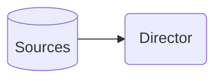
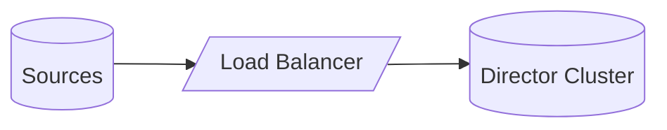
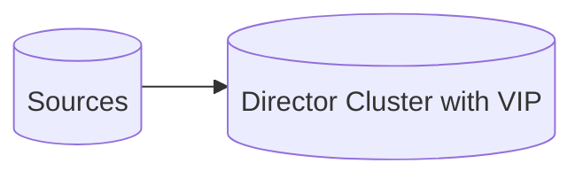

# Devices

**VirtualMetric Director** uses devices as an abstraction layer to collect data from various sources and manage them for telemetry. As such, they decouple data sources from **Director**'s pipelines.

:::note
Each device type provides specific configuration options detailed in their respective chapters.
:::

## Use Categories

Devices come in various categories, depending on their intended purpose of use. The main distinction, however, is OS monitoring versus protocol listening.

### Listening

Data is received from listeners using various network protocols with two types of collection:

**Push-based**: Devices like _Syslog_ (via _UDP_/_TCP_), _SNMP Traps_, _HTTP/HTTPS_, _TCP_/_UDP_, and _eStreamer_ send event data.

**Pull-based**: Data is fetched from _Kafka_ topics, _Microsoft Sentinel_, _REST_ APIs, database queries, and other custom integration types.

### Monitoring

For monitoring operating systems, **Director** uses a unified agent-based approach with two types of deployment:

**Managed** (Traditional): The agent is installed and managed by system administrators. This provides persistent installation on the target system. Local data is buffered in the emergence of network issues. **Director** supports _Windows_, _Linux_, _macOS_, _Solaris_, and _AIX_.

**Auto-managed** (Agentless): 
The agent is automatically deployed and managed, no manual installation is required. Auto-managed agents provide local data buffering, network resilience, and performance optimization. This deployment type is self-healing, since the agent is automatically redeployed if the process terminates. Also, it supports _remote credential management_. Deployment is done using **WinRM** for _Windows_, and **SSH** for _Linux_, _macOS_, _Solaris_, and _AIX_.

Both approaches provide local data processing, store-and-forward capability against connectivity issues, real-time metrics and events, and native OS monitoring. The key difference is deployment and lifecycle management, not functionality.

## Means of Use

Devices enable handling and processing of data through the following means:

**Pipelines**: These provide the capability to parse and enrich messages with custom rules. Data is transformed&mdash;through _field mapping_ and _type conversion_&mdash; and events are correlated and aggregated, custom fields are extracted, tagged, filtered, and routed based on message content. For certain conditions, alerts are generated. Additionally, there is _templating_ support for output formatting, and built-in and custom functions.

**Queues**: These provide persistent message storage, configurable batch processing capability, automatic checkpoint recovery, and rotation and cleanup ability.

## Deployment

As stated above, devices offer various deployment options for different purposes.

### Standalone

With this approach, sources are connected directly to **Director**, bypassing any intermediate mechanism.

### High Availability

Here, sources are first connected to a load balancer&mdash;which distributes the work to multiple processes&mdash;after which they are streamed to either a **Director** cluster:

-or- sources are connected to a cluster with _Variable Information Period_ (VIP):

## Use Cases

Devices are commonly used for the following purposes:

**Infrastructure monitoring**: Provides system performance metrics, event logs, resource utilization, and service availability information.

**Security operations**: Enables security event monitoring, threat detection, compliance monitoring, and provides audit trails.

**Application telemetry**: Provides application logs and performance metrics, and enables error tracking and user activity monitoring.

**Network monitoring**: Provides network device logs and SNMP data, and enables traffic analysis and connection tracking

## Performance

Devices can improve telemetry performance through their multi-worker architecture, dynamic scaling ability, socket reuse optimization, buffer management, and resource monitoring capability.

## Security

For security, devices enable:

**Authentication**: Basic authentication, API keys, HMAC signing, and client certificates.\
**Encryption**: _TLS_/_SSL_, _SNMPv3_ privacy, and custom encryption.

They also provide _access control_, and _audit logging_.

:::warning
Always implement the appropriate security controls when deploying devices in production environments.
:::
