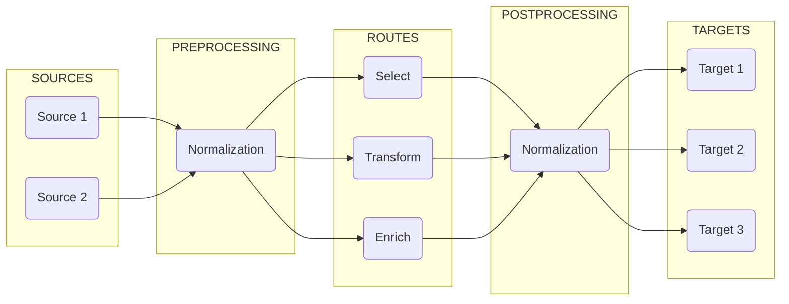

# Administration: Overview

The following chapters document the administration features of **Director**, a streamlined solution designed for efficient log collection and processing.

## Core Components

**Director**'s administration revolves around five key components:

1. **Devices**: Sources of log data (e.g. syslog or estreamer)
2. **Pipelines**: Processing workflows for data transformation
3. **Processors**: Individual data manipulation functions
4. **Routes**: Traffic control for directing data flows
5. **Targets**: Destinations for processed data (e.g. Sentinel or storage systems)

To understand why these components are necessary, take a look at the following graphic that illustrates the stages of telemetry:



## Configuration Structure

**Director** uses YAML configuration files organized in a hierarchical structure:

```plaintext
<vm_root>/
├── config/
│   ├── devices/
│   │   ├── syslog.yaml
│   │   ├── estreamer.yaml
│   │   └── tcp.yaml
│   ├── targets/
│   │   ├── sentinel.yaml
│   │   └── storage.yaml
│   ├── routes/
│   │   └── main.yaml
│   └── vmetric.yaml
├── package/
│   └── definitions/
│       └── pipelines/
│           ├── checkpoint.yaml
│           ├── cisco.yaml
│           └── normalize.yaml
└── user/
    └── definitions/
        └── pipelines/
            ├── checkpoint.yaml
            └── normalize.yaml
```

### Package vs User Directories

- **Package Directory**: Contains built-in templates and definitions

  - Located at `package/definitions/`
  - Updated with new Director versions
  - Should not be modified directly
  - Serves as reference for default configurations

- **User Directory**: Contains custom configurations

  - Located at `user/definitions/`
  - Never overwritten by updates
  - Takes precedence over package definitions
  - Used for all customizations

:::warning
Never modify the files in the `package` directory. Instead, copy these templates to the corresponding location in the `user/definitions` directory and modify them there. The `user` directory configurations override package definitions and are preserved during updates.
:::

## Administration Tasks

### Configuration Management

- Create and modify configuration files
- Validate configuration syntax
- Apply configuration changes
- Back up configurations

### Device Management

- Add new data sources
- Configure input parameters
- Monitor device health
- Troubleshoot connectivity

### Pipeline Administration

- Design processing workflows
- Configure processors
- Test transformations
- Optimize performance

### Route Control

- Define traffic patterns
- Set up filtering rules
- Configure destinations
- Monitor data flow

### System Monitoring

- Track performance metrics
- Monitor resource usage
- Review error logs
- Generate reports

## Security Considerations

### Authentication

- Configure access controls
- Manage credentials
- Set up encryption
- Monitor access logs

### Network Security

- Configure TLS/SSL
- Set up firewalls
- Manage certificates
- Control port access

### Data Protection

- Secure sensitive data
- Configure encryption
- Manage retention
- Handle compliance

## Best Practices

1. **Configuration Management**

   - Use version control
   - Document changes
   - Test before deployment
   - Maintain backups

2. **Performance Optimization**

   - Monitor resource usage
   - Optimize configurations
   - Balance loads
   - Schedule maintenance

3. **Security**

   - Regular updates
   - Security audits
   - Access control
   - Encryption

4. **Monitoring**

   - Performance metrics
   - Error tracking
   - Resource usage
   - Health checks

## Troubleshooting

### Common Issues

- Configuration errors
- Connection problems
- Processing failures
- Resource constraints

### Resolution Steps

1. Check configurations
2. Review logs
3. Verify connectivity
4. Monitor resources
5. Test solutions

## Next Steps

1. Review the Quick Start guide
2. Explore component documentation
3. Set up your first configuration
4. Monitor and optimize
