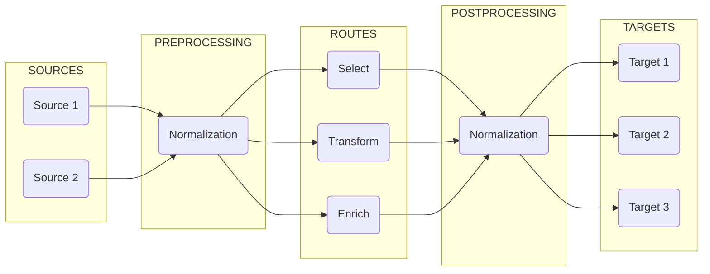

# Administration: Overview

The following chapters document the administration features of **Director**.

## Key Components

The administration of **Director** involves the following key components which are used for telemetry purposes:

<TermTable>
   <TermCol>[Devices](/docs/administration/devices/overview.mdx) </TermCol>
   <DefCol>Sources of log data, e.g. syslog or estreamer</DefCol>

   <TermCol>[Pipelines](/docs/administration/pipelines/overview.mdx) </TermCol>
   <DefCol>Processing workflows for data transformation</DefCol>

   <TermCol>[Processors](/docs/administration/pipelines/processors/index.mdx) </TermCol>
   <DefCol>Individual data manipulation functions</DefCol>

   <TermCol>[Routes](/docs/administration/routes/overview.mdx) </TermCol>
   <DefCol>Traffic control for directing data flows</DefCol>

   <TermCol>[Targets](/docs/administration/targets/overview.mdx)</TermCol>
   <DefCol>Destinations for processed data, e.g. Sentinel or a storage system</DefCol>
</TermTable>

The following graphic illustrates the stages that utilize these components:



For the PREPROCESSING, ROUTES, and POSTPROCESSING stages, **Director** uses **Pipelines**, which in turn are composed of **Processors**.

To represent the SOURCES and to communicate with them to stream data, **Director** uses **Devices**.

To forward processed data to TARGETS, **Director** uses **Targets**.

### System Directories

To help design and configure the pipelines that will combine the above stages with one another, **Director** uses YAML files organized in a hierarchical structure under the `vm_root` directory:

```plaintext
<vm_root>/
├── config/
│   ├── devices/
│   │   ├── syslog.yaml
│   │   ├── estreamer.yaml
│   │   └── tcp.yaml
│   ├── targets/
│   │   ├── sentinel.yaml
│   │   └── storage.yaml
│   ├── routes/
│   │   └── main.yaml
│   └── vmetric.yaml
├── package/
│   └── definitions/
│       └── pipelines/
│           ├── checkpoint.yaml
│           ├── cisco.yaml
│           └── normalize.yaml
└── user/
    └── definitions/
        └── pipelines/
            ├── checkpoint.yaml
            └── normalize.yaml
```

All administration tasks are carried out with these files. They contain predefined fields with specific data types, and **Director** uses them to spawn and run its processes.

### Definition Files

Two directories are of key importance in this regard: the `package` directory, and the `user` directory.

The `package` directory contains templates and ready-to-use definitions. These definitions are updated with newer versions of **Director**.

:::warning
Never modify the definition files under `package` directly. To create configurations using them as templates, copy the relevant definition file to the corresponding location under `user` first.
:::

The `user` directory contains custom configurations. These definitions take precedence over those under the `package` directory.

The definitions under `user` override the definitions under `package`, and they are preserved between updates.

## Basic Tasks

The system administrator's responsibilities cover the following areas.

### System administration

This entails maintaining an up-and-running system by attending to the following:

* **Settings** - Creating and modifying the setting files, validating and applying them, and keeping backups of them.

* **Devices** - Creating devices to listen new data sources, configuring their input parameters, monitoring their health, and troubleshooting connectivity issues.

* **Pipelines** - Designing workflows, configuring processors, test the transformations, and optimizing performance

* **Routes** - Defining traffic patterns, setting up filtering rules, configuring destinations, and monitoring data flows

* **System monitoring** - Tracking performance metrics, monitoring resource usage, reviewing error logs, and generating reports

### Security

A crucial aspect of system administration is security. This requires attending to the following:

* **Authentication** - Configuring access controls, managing credentials, setting up encryption, and monitoring access logs

* **Networks** - Configuring TLS/SSL, setting up firewalls, managing certificates, and controlling port access

* **Data protection** - Securing sensitive data, configuring encryption, managing data retention, and supervising compliance

## Best Practices

In order to maintaing the integrity, robustness, and health of a system, some guidelines have to observed:

For _managing configurations_, use version control, document the changes, and always keep backups. Also, never forget to test before deploying.

For _performance optimization_, first monitor the resource usage and balance the loads if necessary. Optimizing the configurations is the next thing to check. And do not forget to schedule maintenance. Error tracking and health checks must also be always kept in mind.

Finally, for _security_, regular updates is essential. There must be official security audits, particularly on access control and encryption.

## Troubleshooting

System administration frequently involves dealing with failures and problem solving. The most common issues are configuration errors, connection problems, unhandled processing errors, and violated resource constraints.

The resolution steps are checking the configurations and reviewing the logs, verifying connectivity and resource availability, and testing the solutions.
