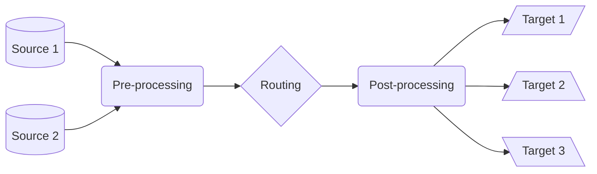

# Pipeline Types: Overview

**Director** organizes pipelines into distinct types based on their role in log processing and their position in the data flow. Each type serves a specific purpose and operates at a different stage of the processing lifecycle.

The pipeline types are designed to handle different aspects of log processing:

Each stage performs specific transformations:

## Pre-processing

Pre-processing pipelines are attached to sources and prepare data before it enters the routing stage. They focus on:

**Data reduction** - Filtering unnecessary events, removing redundant fields, sampling high-volume data, and aggregating similar events

**Initial normalization** - Field and protocol standardization, and format conversion and time normalization

**Early enrichment** - Geolocation data, asset information, basic threat intelligence, and custom metadata

## Post-processing

Post-processing pipelines are attached to targets and perform final transformations before data storage or analysis:

**Format finalization** - Target-specific formatting, schema alignment, and final field mapping

**Storage optimization** - Compression configuration, index preparation, partitioning strategy, and retention setup

**Integration requirements** - Target-specific transformations, protocol adaptation, authentication preparation, and error handling

## Normalization

Normalization pipelines handle the conversion between different log formats throughout the processing chain:

Standard formats are:

- ECS (Elastic Common Schema)
- CIM (Common Information Model)
- ASIM (Advanced Security Information Model)
- CEF (Common Event Format)
- LEEF (Log Event Extended Format)
- CSL (Common Security Log)

Key transformations are field name standardization, data type normalization, structure unification, and time format alignment

:::warning
Avoid mixing responsibilities between pipeline types. Keep pre-processing, routing, and post-processing concerns separate for maintainability and performance.
:::

## Benefits of Type Separation

Provides clear responsibilities since each pipeline type has a specific role, they are easier to maintain and debug, and they enable better performance optimization and clearer error handling

**Optimized performance** - Reduced processing overhead, better resource utilization, improved scalability, and more efficient routing

**Enhanced maintainability** - Modular architecture, easier updates, more robust testing, and clearer documentation

## Best Practices

Pipeline design must: keep pipelines focused on their type's purpose, minimize cross-type dependencies, use appropriate processors for each stage, and document type-specific requirements

For _performance optimization_, process heavy transformations early, optimize routing decisions, minimize redundant processing, and monitor type-specific metrics

For _error handling_, implement stage-appropriate ones, use type-specific failure responses, maintain clear error boundaries, and log errors with context

:::tip
Design your pipelines with their type in mind. Each type has specific goals in the lifecycle, and optimizations that work best at one stage may not work for the others.
:::
