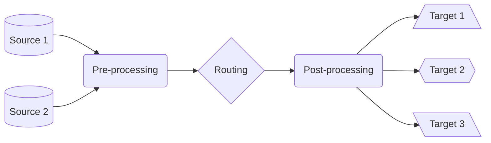

# Pipeline Types: Overview

**VirtualMetric Director** organizes pipelines into distinct types based on their role and specific purpose.

## Pre-processing

Pre-processing pipelines are attached to _sources_, and prepare the data before it enters the routing stage. They focus on:

**Data reduction** - Filtering unnecessary events, removing redundant fields, sampling high-volume data, and aggregating similar events

**Initial normalization** - Field and protocol standardization, and format conversion and time normalization

**Early enrichment** - Geolocation data, asset information, basic threat intelligence, and custom metadata

## Normalization

Normalization pipelines handle the conversion between different log formats throughout the processing chain. The primary transformations are field name standardization, data type normalization, structure unification, and time format alignment.

## Post-processing

Post-processing pipelines are attached to _targets_, and perform final transformations before data storage and analysis:

**Format finalization** - Target-specific formatting, schema alignment, and final field mapping

**Storage optimization** - Compression configuration, index preparation, partitioning strategy, and retention setup

**Integration** - Target-specific transformations, protocol adaptation, authentication preparation, and error handling

## Best Practices

Leverage the benefits of _type seperation_. This clearifies the responsibility of each by assigning a specific role. It also enables modular architecture and robust testing. Finally, it reduces overhead through better resource utilization, and improves scalability and routing efficiency.

Keep the pipelines focused on their _purpose_, and minimize cross-type dependencies.

For _performance optimization_, process heavy transformations early, optimize routing decisions, and monitor type-specific metrics.

For _error handling_, implement stage-appropriate ones, use type-specific failure responses, maintain clear error boundaries, and log errors with context.

