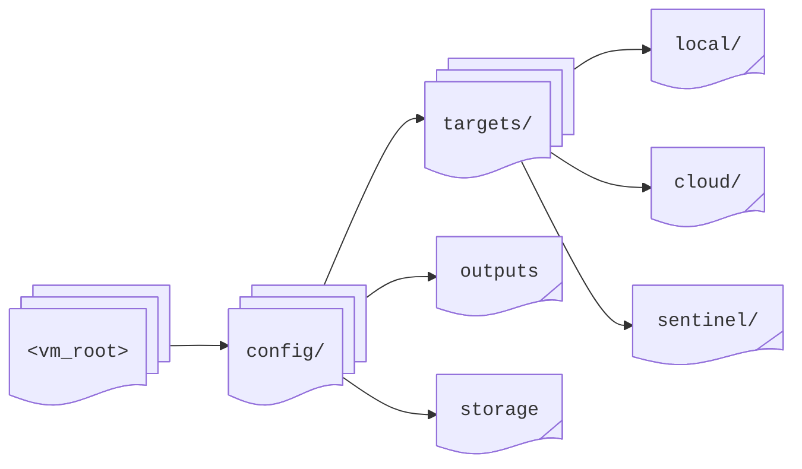

# Targets: Overview

**Director** uses _targets_ as the output destinations to forward, store, and analyze collected telemetry data. Targets provide flexible options for data persistence and integration with various analysis platforms.

## Configuration

All target configuration files reside in the `config` directory under the root, and have `.yaml` or `.yml` extensions:

{/* ```powershell title="<vm_root>/"
config/
├── targets/
│   ├── local/
│   ├── cloud/
│   └── sentinel/
├── outputs/
└── storage/
``` */}



**Director** recursively discovers all configuration files, regardless of subfolder structure.

:::note
Each target type provides specific configuration options detailed in its respective chapter.
:::

## Categories

### Local Storage

**Director** supports the following local data output methods:

* **Console** - Direct _stdout_ writing with real-time message viewing. Also provides debugging and testing capability, format normalization, and synchronous writing with mutex locking

* **Files** - Multiple file formats like JSON (line-delimited), Avro (binary serialization), OCF (container), Parquet (columnar) are available. In addition, compression options like ZSTD (default), GZIP, Snappy, Brotli, and LZ4 are also supported. Also, dynamic file naming, size-based rotation, buffer management, and schema validation are among the features.

### Cloud Storage

The integration options for the cloud are below:

* **Azure Blob** - Direct blob writing and multiple containers are supported. Available authentication methods are service principal and managed Identity. Other features include automatic retries, exponential backoff, size-based chunking, connection pooling, and buffer management.

* **Microsoft Sentinel** - Direct DCR integration and ASIM normalization are supported. In addition to standard tables, _WindowsEvent_, _SecurityEvent_, _CommonSecurityLog_, and _Syslog_ can be used. Various ASIM tables are also available. (See the [ASIM section](/docs/reference.mdx#asim) for a complete list.)

## Options

The following _processing options_ are available for targets:

* **Pipelines** - Field normalization (ECS, CIM, ASIM, CEF, LEEF, CSL), data transformation, message batching, custom field mapping, schema validation, and format conversion.

* **Buffer management** - Configurable buffer sizes, batch processing, flush intervals, queue management, checkpoint recovery, and error handling

* **Performance** - Asynchronous writing, buffer optimization, connection pooling, retry mechanisms, resource monitoring, and size-based rotation

* **Security** - Authentication using API keys, service principals, and client certificates. Encryption with TLS/SSL, HTTPS, or custom. Also, access control and audit logging.

## Deployment

The available deployment types are:

* **Single**

  ```mermaid
  block-beta
    columns 5
    A("Director"):2
    space
    B("Target"):2
    A --> B
  ```

* **Multiple**

  ```mermaid
  block-beta
    columns 5
    A("Director"):2
    space
    B("Target 1"):2
    space
    space
    space
    C("Target 2"):2
    space
    space
    space
    D("..."):2
    A --> B
    A --> C
    A --> D
  ```

* **Chained**

  ```mermaid
  graph LR
    A("Director")
    B("Local
    Storage")
    C("Cloud
    Upload")
    D("Analysis
    Platform")
    A --> B
    B --> C
    C --> D
  ```

:::warning
Always implement appropriate security controls and monitor storage capacity when deploying targets in production environments.
:::

## Common Uses

The most common uses of targets are:

* **Local analysis** - Debug logging, performance analysis, audit trails, and temporary storage.

* **Cloud integration** - Long-term storage, data warehousing, security analysis, and compliance monitoring

* **Real-time analysis** - Live monitoring, alert generation, trend analysis, and performance tracking

* **Data lake building** - Raw data storage, schema evolution, data partitioning, and analytics preparation
