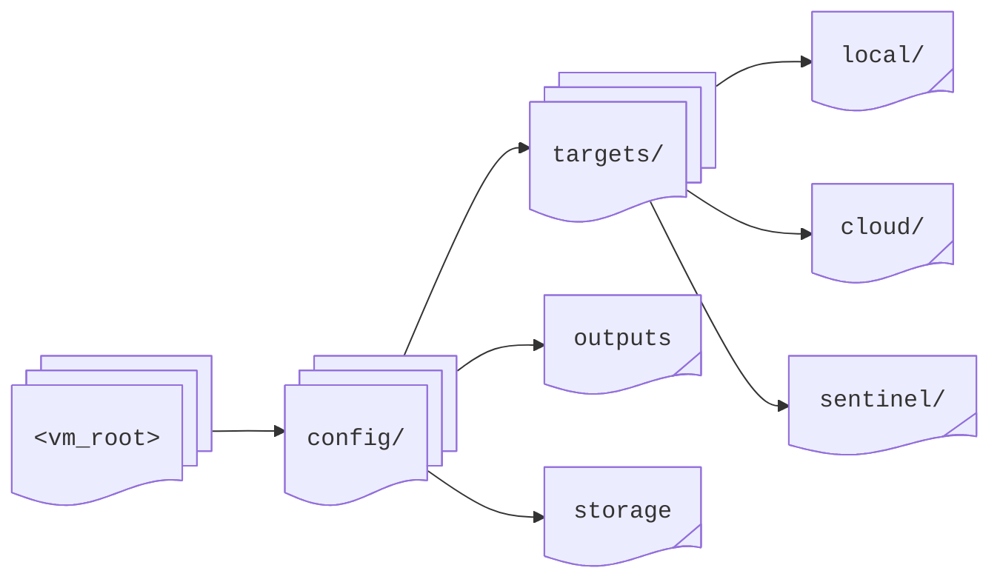

# Targets: Quick Start

This guide will walk you through configuring your first target in **Director**, to illustrate various output options available for your log data.

## Configuration

All target configuration files reside in the `config` directory under the root, and have a `.yml` extension:



**Director** recursively discovers all configuration files, regardless of subfolder structure.

:::note
Each target type provides specific configuration options detailed in its respective chapter.
:::

Targets use the configuration files with `.yml` extensions in the `config` directory under the root, e.g.

* `<vm_root>/config/targets.yml`
* `<vm_root>/config/targets/outputs.yml`
* `<vm_root>/config/target/outputs/sentinel.yml`

**Director** searches recursively through the directory to spot these files. Choose the organization that best fits your needs.

## Console

Create a console configuration for a simple `stdout` output, e.g.:

```yaml title="config/targets/console.yml"
- id: 1
  name: debug_output
  type: console
  properties:             
    format: "ecs"
```

Here, `1` is the unique identifier of the target, `console` is its type, and we intend to normalize the data to the ECS format, although this is optional.

## Files

Various file formats are available for local storage.

* The ever-present **JSON** format is supported:

  ```yaml title="config/targets/file.yml"
  - id: 2
    name: local_logs
    type: file
    properties:
      location: "/var/log/vmetric"
      type: "json"
      name: "logs_{{.Year}}_{{.Month}}_{{.Day}}.json"
  ```

* For more efficient results, the **Parquet** format can be used:

  ```yaml
  - id: 3
    name: structured_logs
    type: file
    properties:
      location: "/var/log/vmetric"
      type: "parquet"
      compression: "zstd"
      schema: |
        {
          "timestamp": {
            "type": "INT",
            "bitWidth": 64,
            "signed": true
          },
          "message": {
            "type": "STRING",
            "compression": "ZSTD"
          }
        }
  ```

:::note
File targets with no messages are automatically cleaned up when disposed.
:::

## Cloud

Cloud storage formats are also readily available.

* **Azure Blob** can be configured for output:

  ```yaml title="config/targets/azblob.yml"
  - id: 4
    name: cloud_logs
    type: azblob
    properties:
      account: "mystorageaccount"
      tenant_id: "${AZURE_TENANT_ID}"
      client_id: "${AZURE_CLIENT_ID}"
      client_secret: "${AZURE_CLIENT_SECRET}"
      container: "logs"
      type: "parquet"
      compression: "zstd"
      max_size: 536870912  # 512MB
  ```

* **Microsoft Sentinel** with ASIM normalization can be used:

  ```yaml title="config/targets/sentinel.yml"
  - id: 5
    name: sentinel_logs
    type: sentinel
    properties:
      tenant_id: "${AZURE_TENANT_ID}"
      client_id: "${AZURE_CLIENT_ID}"
      client_secret: "${AZURE_CLIENT_SECRET}"
      rule_id: "${DCR_RULE_ID}"
      endpoint: "${DCR_ENDPOINT}"
      stream:
        - "Custom-ASimProcessEventLogs"
        - "Custom-ASimNetworkSessionLogs"
  ```

## Performance

For high-volume environments

* With files, enable buffering and use compression:

  ```yaml
      no_buffer: false
      compression: "zstd"
  ```

* For _Azure Blob_, increase the number of retry attempts and the retry interval, and use **512MB** chunks:

  ```yaml
      max_retry: 10
      retry_interval: 30
      max_size: 536870912
  ```

* For _Microsoft Sentinel_, a **5MB** buffer is recommended:

  ```yaml
      buffer_size: 5242880
  ```

## Monitoring

Watch Director's logs for target initialization messages, upload/ingestion status, and buffers and retries.

:::tip
Use environment variables for sensitive credentials, and adjust buffer sizes based on your ingestion volume.
:::

:::warning[caution]
When deploying in production environments, always implement appropriate security controls, and monitor storage capacity.
:::

## Next Steps

You can now consider

- configuring multiple targets for redundancy
- implementing custom normalization rules
- putting alerts in place for notifications and error handling

to complete the process.
