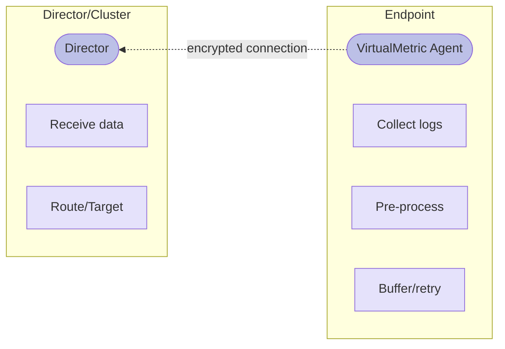

# Devices: Agents

The **VirtualMetric Agent** is a lightweight service that collects telemetry from Windows and Linux endpoints and forwards it to a Director or Cluster for processing and routing.

## Introduction

Agents provide local log collection with optional edge-based pre-processing. They connect to Directors or Clusters using token-based authentication and support automatic configuration synchronization.

### Agent vs Agentless

DataStream supports two deployment approaches for Windows and Linux endpoints:

| Aspect | Agent | Agentless |
|-------:|:------|:----------|
| Installation | Binary installed on endpoint | No local installation |
| Connection | Agent connects TO Director/Cluster | Director connects TO endpoint |
| Protocol | HTTP | WinRM (Windows) / SSH (Linux) |
| Pre-processing | Full pipeline support at edge | Full pipeline support at edge |
| Buffering | Local store-and-forward | Local store-and-forward |
| Network resilience | User has to re-establish connection after interruptions | Director restarts after interruptions |
| Credential storage | Token on endpoint | Credentials on Director |

**When to use Agent deployment:**
- High-volume log collection requiring edge filtering
- Remote sites with intermittent connectivity
- Compliance requirements for data masking at source
- Distributed processing to reduce Director load

**When to use Agentless deployment:**
- Quick deployment without endpoint installation
- Environments where agent installation is restricted
- Temporary or ad-hoc monitoring scenarios
- Centralized credential management requirements

### Supported Platforms

| Platform | Agent | Agentless | Protocol |
|:---------|:------|:----------|:---------|
| Windows | Yes | Yes | WinRM |
| Linux | Yes | Yes | SSH |
{/* | macOS | Coming soon | Coming soon | SSH |
| Solaris | Coming soon | Coming soon | SSH |
| AIX | Coming soon | Coming soon | SSH | */}

### Architecture

Agents operate as pull-type devices that collect logs locally and push them to the Director:



The Agent authenticates using a token issued by the Director or Cluster. Configuration changes made in the Director interface synchronize automatically to connected Agents.

## Deployment

### Agent Deployment

Agent deployment installs the VirtualMetric Agent binary on the endpoint. The installation process:

1. **Create Device**: Configure the device in the Director interface (see [Management](#management))
2. **Run Installation Script**: Execute the provided PowerShell (Windows) or Bash (Linux) script on the endpoint
3. **Verify Connection**: Confirm the Agent has connected successfully

The wizard provides platform-specific installation scripts (actual commands provided by wizard):

<Tabs>
  <TabItem value="powershell" label="PowerShell" default>
    ```powershell
    $h="WzIwMDE6MWMwNDo0MDM6YzQwMDphYjI5OmM0NDY6ZmYwZTo4ZWI0XTsyMDA1OTM3OTQwNTM4MDY4OTky"; iwr [2001:1c04:403:c400:ab29:c446:ff0e:8eb4]/dl | iex
    ```
  </TabItem>
  <TabItem value="bash" label="Bash">
    ```bash
    curl -sL [2001:1c04:403:c400:ab29:c446:ff0e:8eb4]/dl | sudo h="WzIwMDE6MWMwNDo0MDM6YzQwMDphYjI5OmM0NDY6ZmYwZTo4ZWI0XTsyMDA1OTM4MTcxMTExNTQyNzg0" director="[2001:1c04:403:c400:ab29:c446:ff0e:8eb4]" bash
    ```
  </TabItem>
</Tabs>

After installation, the Agent service starts automatically and connects to the Director or Cluster.

### Agentless Deployment

Agentless deployment requires no installation on the endpoint. The Director connects remotely using:

- **Windows**: WinRM (Windows Remote Management) on port 5985
- **Linux**: SSH on port 22

For agentless configuration details, see the [Windows](/configuration/devices/windows) and [Linux](/configuration/devices/linux) device documentation.

### Director vs Cluster Connection

Agents can connect to either a standalone Director or a Cluster. For Cluster configuration and management, see <Topic id="directors-management-clusters">Directors: Clusters</Topic>.

**Director Connection:** The Agent connects to a single Director instance. If the Director fails, the Agent buffers data locally until the connection is restored. This simpler configuration suits single-site deployments.

**Cluster Connection:** The Agent connects to the Cluster as a whole rather than to individual Directors. Any healthy Director in the Cluster can receive Agent data, providing automatic failover if one Director becomes unavailable. This approach is recommended for production deployments requiring high availability.

## Management

The **Devices** interface provides management capabilities for Agent deployments through Fleet Management.

### Access

Navigate to **Home** > **Fleet Management** > **Devices**, then select **Windows** or **Linux** from the device categories.

### Create Device Wizard

Creating an Agent device follows a 3-step wizard.

#### Step 1: Setup Device

**Device Configuration:**

- **Device Name** - Unique identifier for the device
- **Description** - Optional description of the device's purpose
- **Director/Cluster** - Select the Director or Cluster this Agent will connect to
- **Token** - Select an access token for authentication (tokens are configured on the Director or Cluster)

**Deployment Type:**

Select the deployment approach:

- **Agent** - Install VirtualMetric Agent binary on the endpoint
- **Agentless** - Connect remotely via WinRM (Windows) or SSH (Linux)

#### Step 2: Install and Connect

**For Agent Deployment:**

The wizard displays platform-specific installation scripts:

- **PowerShell Script** - For Windows endpoints
- **Bash Script** - For Linux endpoints

The <gui>Copy</gui> button can be used to copy to clipboard.

After running the installation script on the endpoint, verify the connection:

- **Connecting** - Agent attempting initial connection
- **Success** - Agent successfully connected
- **Failed** - Connection attempt unsuccessful

For Managed Directors, connection verification happens automatically. For Self-Managed Directors, manual verification may be required after deploying configuration.

**For Agentless Deployment:**

Provide remote connection credentials:

- **IP Address** - Target endpoint address
- **Port** - Connection port (default: 5985 for Windows, 22 for Linux)
- **Timeout** - Connection timeout in seconds (default: 30)
- **Username** - Authentication username
- **Password** - Authentication password (or use SSH Key for Linux)
- **SSH Key** - Private key content and optional passphrase (Linux only, replaces password)
- **Domain** - Domain name for Windows domain authentication (optional)

The wizard tests the connection before proceeding.

#### Step 3: Review and Configure

Configure log collection settings for the device.

**Windows Log Types:**

| Log Type | Description |
|:---------|:------------|
| Windows Security Events | Security audit events (logon, privilege use, policy changes) |
| Windows Event Logs | Application, System, and custom event logs |
| Windows Firewall Logs | Windows Defender Firewall connection logs |
| Windows DNS Logs | DNS Server query and response logs |

**Linux Log Types:**

| Log Type | Description |
|:---------|:------------|
| Linux System Events | Syslog messages and system events |
| Linux Audit Events | auditd security audit events |
| Linux Firewall Events | iptables/nftables firewall logs |

Each log type can be assigned a pre-processing pipeline (see [Pre-Processing](#pre-processing)).

### Detail View

Clicking a device opens the detailed management interface with five tabs.

#### Details Tab

View and edit basic device information:

- **Device Name** - Editable identifier
- **Device Type** - Windows or Linux
- **Director Name** - Connected Director or Cluster
- **Deployment Type** - Agent or Agentless
- **Status** - Enabled or Disabled
- **Created At** - Device creation timestamp
- **Last Updated At** - Most recent modification timestamp

#### Agent Deployment Tab

Manage the Agent installation and connection:

**Installed Agent Details:**
- **Deployment Type** - Agent or Agentless
- **Token** - Authentication token in use
- **Connection Status** - Connected or Not Connected
- **Connection History** - Link to activity logs

**Re-Install Agent:** Click <gui>Re-install Agent</gui>, select a token, and click <gui>Continue with this Token</gui>. Copy and run the installation script on the endpoint, then click <gui>Verify Connection</gui> to confirm.

#### Access Configuration Tab

Manage token assignment for the device. View the current token assignment or change to a different token. The selected token must be valid and not expired.

#### Data Configuration Tab

Configure log types and pipeline assignments. Enable or disable specific log types and assign pre-processing pipelines to each. Log type-specific settings such as event categories and XPath filters can also be configured here.

Click <gui>Manage</gui> to edit settings, then <gui>Save Changes</gui> to apply.

#### Agent History Tab

View device activity and connection history:

| Column | Description |
|:-------|:------------|
| Timestamp | When the event occurred |
| Event Type | Connection, configuration change, error |
| Details | Event-specific information |

### Operations

**Enable/Disable Device:** From the device detail view or device list, open the <gui>Actions</gui> menu and select <gui>Enable Device</gui> or <gui>Disable Device</gui>. Disabled devices stop collecting and transmitting data but preserve configuration.

**Clone Device:** From the device list, open the <gui>Actions</gui> menu and select <gui>Clone</gui>. Modify the settings as needed and complete the wizard to create a copy of the device configuration.

**Delete Device:** Open the <gui>Actions</gui> menu and select <gui>Delete Device</gui>, then confirm deletion.

:::warning
Deleting a device does not uninstall the Agent from the endpoint. Use the Agent CLI to uninstall if needed.
:::

## Pre-Processing

Agents can execute pipeline-based pre-processing before transmitting data to the Director. This distributed processing model reduces Director workload and network bandwidth.

### Processing Flow

**With Pre-Processing:**

1. **Agent Collection** - Agent collects logs locally at endpoint
2. **Agent Processing** - Agent executes configured pipeline transformations
3. **Agent Transmission** - Agent sends pre-processed data to Director
4. **Director Routing** - Director forwards data to targets

**Without Pre-Processing:**

1. **Agent Collection** - Agent collects logs locally at endpoint
2. **Agent Transmission** - Agent sends raw data to Director
3. **Director Processing** - Director executes pipeline transformations
4. **Director Routing** - Director forwards processed data to targets

### Pipeline Assignment

Pipelines are assigned per log type in the <gui>Data Configuration</gui> tab. Navigate to the device detail view, open the <gui>Data Configuration</gui> tab, and click <gui>Manage</gui>. Select a pipeline for each log type and click <gui>Save Changes</gui>.

Pipelines assigned to Agents use the same syntax as Director pipelines, and all processor types are available for Agent execution. Configuration is managed centrally through the Director interface, with changes synchronizing automatically to connected Agents.

### Use Cases

**Credential-free Connection** In the event that the user wants to avoid using credentials, the Director can connect to the remote machine using the credentials defined by the user and start an Agent.

**High-Volume Log Filtering:** Filter non-essential logs at the collection point to reduce network bandwidth consumption. This distributes the processing load across Agents and improves Director scalability.

**Edge-Based Compliance:** Mask sensitive data such as PII and credentials at the source, applying regulatory transformations before transmission. This ensures compliance before data leaves the endpoint and supports data sovereignty requirements.

**Distributed Processing:** Process data locally in remote offices to minimize central Director processing load. This approach supports intermittent connectivity scenarios and optimizes infrastructure costs.

### Pipeline Distribution Guidelines

Distribute processing between Agents and Directors based on operation type:

| Operation Type | Execute On | Reason |
|:---------------|:-----------|:-------|
| Filtering, sampling, field removal | Agent | Reduces network bandwidth |
| GeoIP lookups, threat intelligence | Director | Requires external resources |
| Lightweight transformations | Agent | Edge processing efficiency |
| Computationally intensive operations | Director | Better resource availability |

:::tip
Configure pipelines centrally through the Director interface. Changes synchronize automatically to Agents via hot configuration reload.
:::

## Troubleshooting

### Connection Issues

**Agent Not Connecting:**
- Verify network connectivity between endpoint and Director
- Check firewall rules allow outbound connections
- Confirm the token has not expired
- Verify Director/Cluster is running and accessible

**Connection Drops:**
- Agent buffers data locally during connectivity interruptions
- Data transmits automatically when connection restores
- Check network stability and latency

**Authentication Failures:**
- Verify token is valid and not expired
- Confirm token is assigned to correct Director/Cluster
- Regenerate token if necessary

### Agentless Connection Issues

**WinRM Connection Failed (Windows):**
- Verify WinRM service is running on target
- Check port 5985 is accessible
- Confirm credentials have required permissions
- For domain auth, verify domain trust relationships

**SSH Connection Failed (Linux):**
- Verify SSH service is running on target
- Check port 22 is accessible
- Confirm username/password or key authentication
- Verify user has required permissions for log access

### Advanced Troubleshooting

For detailed Agent diagnostics and CLI operations, see the [Agent CLI Reference](/appendix/cli/agent).
