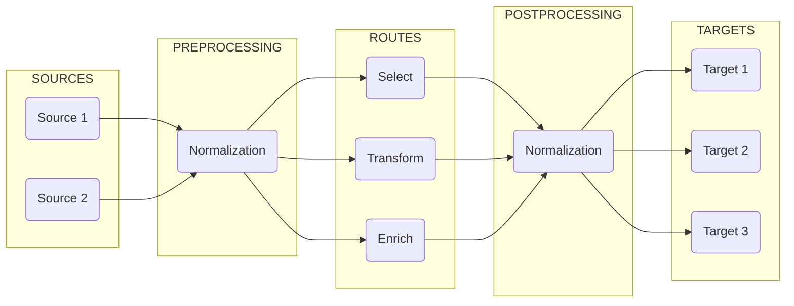

# Configuration: Overview

**DataStream**'s configuration involves the following key components:

<TermTable>
   <TermCol>[**Devices**](/configuration/devices/index.mdx) </TermCol>
   <DefCol>Sources of log data, e.g. syslog or estreamer</DefCol>

   <TermCol>[**Pipelines**](/configuration/pipelines/index.mdx) </TermCol>
   <DefCol>Processing workflows for data transformation</DefCol>

   <TermCol>[**Processors**](/configuration/pipelines/processors/index.mdx) </TermCol>
   <DefCol>Individual data manipulation functions</DefCol>

   <TermCol>[**Routes**](/configuration/routes/index.mdx) </TermCol>
   <DefCol>Traffic control for directing data flows</DefCol>

   <TermCol>[**Targets**](/configuration/targets/index.mdx)</TermCol>
   <DefCol>Destinations for processed data, e.g. Sentinel or a storage system</DefCol>
</TermTable>

The graphic below illustrates the various stages where these components are used and how they connect to each other:

For the PREPROCESSING, ROUTES, and POSTPROCESSING stages, **Director** uses **Pipelines**, which are composed of **Processors**.

To ingest data from the SOURCES and to communicate with them, **Director** uses **Devices**.

To forward processed data to TARGETS and to communicate with them, **Director** uses **Targets**.

## Directories

To help design the logic of the components that will define and run the processes of the above-mentioned stages, **DataStream** utilizes configuration files that can be found in the folders under `vm_root`:

All administration tasks are carried out with these files.

## Files

By default, the configuration files for each type of component have their own directory. These files contain predefined fields that these components recognize, and **Director** uses the settings defined in them to spawn and run its processes.

Two directories are of significance: `package` and `user`.

The `package` directory contains templates and ready-to-use definitions. These definitions are updated with newer versions of **Director**.

:::warning
Never modify the definition files under `package` directly. To create a configuration using one of these as a template, copy the relevant file to the corresponding location under `user` first, and then edit it to suit your needs.
:::

The `user` directory contains custom configurations. These definitions take precedence over those under the `package` directory.

The definitions under `user` override the definitions under `package`, and they are preserved between updates.

The configurations may be placed in separate files or they may be grouped together logically, i.e. based on their intended purpose of use or the type of data streams they process. By default, these files reside in the directories under the `config` folder, and have a `.yml` extension.

:::tip
You can place your files anywhere you wish under the `config` directory. **Director** discovers all of them by traversing the folders recursively.
:::

To illustrate, a target file can be named as, e.g.

> `config/target.yml`

-or-

> `config/targets/outputs.yml`

-or-

> `config/targets/outputs/sentinel.yml`

As the nesting level increases, file names become more specific, offering additional context for classification.

It is also possible to use _standalone_ files placed in any arbitrary directory you wish. In that case, however, the full path of the file must be supplied to **Director**.

Select the organizational style that best suits your needs.

:::note
All configuration files must conform to [these rules](/docs/appendix.mdx#configuration-bnf).

The **Schema** sections in the relevant chapters provide the fields used by the component.
:::

## Administration

The system administrator's responsibilities cover the following.

### Maintenance

This entails maintaining an up-and-running system by attending to the following:

* Creating and modifying the setting files, validating and applying them, and keeping backups of them.

* Creating devices to listen new data sources, configuring their input parameters, monitoring their health, and troubleshooting connectivity issues.

* Designing workflows, configuring processors, test the transformations, and optimizing performance

* Defining traffic patterns, setting up filtering rules, configuring destinations, and monitoring data flows

* Monitoring and tracking performance metrics, monitoring resource usage, reviewing error logs, and generating reports

### Security

A crucial aspect of system administration is security. This requires attending to the following:

* Configuring access controls, managing credentials, setting up encryption, and monitoring access logs

* Configuring TLS/SSL, setting up firewalls, managing certificates, and controlling port access

* Securing sensitive data, configuring encryption, managing data retention, and supervising compliance

### Troubleshooting

System administration frequently involves dealing with errors and failures.

The most common issues are related to misconfiguration, connectivity, unhandled disruption of pipelines, and violated resource constraints.

The resolution generally involves checking the configurations and reviewing the logs, verifying connectivity and resource availability, and testing the solution in its final state.

### Best Practices

In order to maintain the integrity, robustness, and health of a system, some guidelines should be observed:

For _managing configurations_, use version control, document the changes, and always keep backups. Also, never forget to test before deploying.

For _performance optimization_, first monitor the resource usage and balance the loads if necessary. Carefully assess the processor combinations and order. Error tracking and health checks must also be always kept in mind. And do not forget to schedule maintenance. 

Finally, to maintain a reliable level of _security_, updates are essential. Official security audits must be conducted regularly, particularly on access control and encryption.
