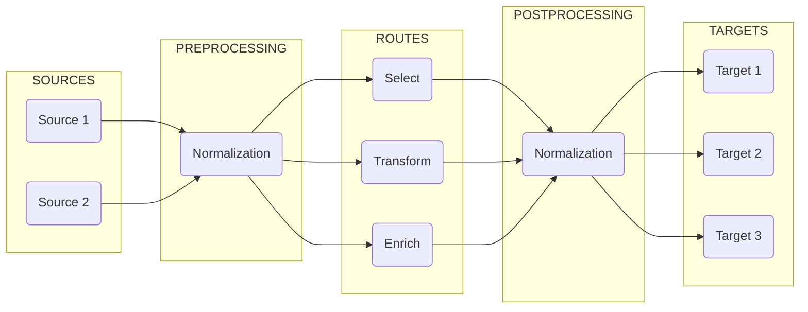
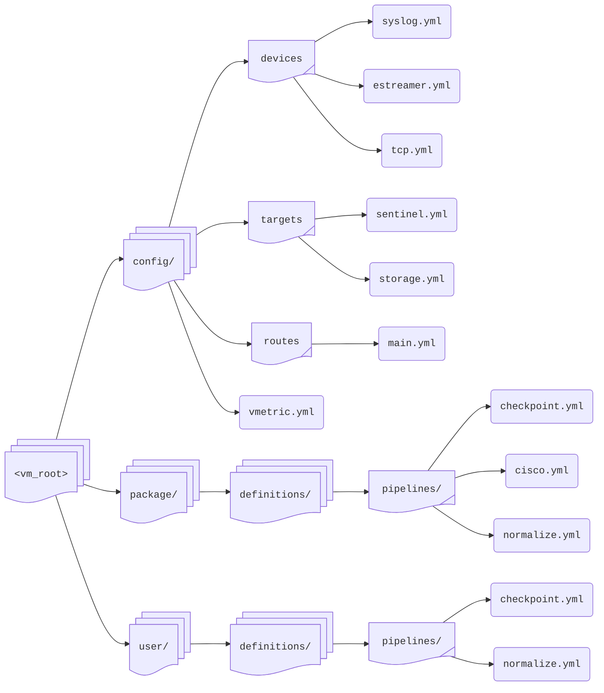

# Configuration: Overview

**DataStream**'s configuration involves the following key components:

<TermTable>
   <TermCol>[**Devices**](/configuration/devices/index.mdx) </TermCol>
   <DefCol>Sources of log data, e.g. syslog or estreamer</DefCol>

   <TermCol>[**Pipelines**](/configuration/pipelines/index.mdx) </TermCol>
   <DefCol>Processing workflows for data transformation</DefCol>

   <TermCol>[**Processors**](/configuration/pipelines/processors/index.mdx) </TermCol>
   <DefCol>Individual data manipulation functions</DefCol>

   <TermCol>[**Targets**](/configuration/targets/index.mdx)</TermCol>
   <DefCol>Destinations for processed data, e.g. Sentinel or a storage system</DefCol>

   <TermCol>[**Routes**](/configuration/routes.mdx) </TermCol>
   <DefCol>Traffic control for directing data flows</DefCol>
</TermTable>

The graphic below illustrates the various stages where these components are used and how they connect to each other:



For the PREPROCESSING, ROUTES, and POSTPROCESSING stages, **Director** uses **Pipelines**, which are composed of **Processors**.

To ingest data from the SOURCES and to communicate with them, **Director** uses **Devices**.

To forward processed data to TARGETS and to communicate with them, **Director** uses **Targets**.

## Files and Directories

To help design the logic of the components that will define and run the processes of the above-mentioned stages, **DataStream** utilizes configuration files that can be found in the folders under `vm_root`:



All tasks are carried out with these configuration files.

By default, these files are placed in a directory based on their component types. They contain predefined fields that the components recognize, and **Director** uses these settings to spawn and run its processes.

Two directories are of significance: `package` and `user`.

The `package` directory contains templates and ready-to-use definitions. These definitions are updated with newer versions of **Director**.

:::warning
Never modify the definition files under `package` directly. To create a configuration using one of these as a template, copy the relevant file to the corresponding location under `user` first, and then edit it to suit your needs.
:::

The `user` directory contains custom configurations. These definitions take precedence over those under the `package` directory.

The definitions under `user` override the definitions under `package`, and they are preserved between updates.

The configurations may be placed in separate files or they may be grouped together logically, i.e. based on their intended purpose of use or the type of data streams they process. By default, these files reside in the directories under the `config` folder, and have a `.yml` extension.

:::tip
You can place your files anywhere you wish under the `config` directory. **Director** discovers all of them by traversing the folders recursively.
:::

To illustrate, a target file can be named as, e.g.

> `config/target.yml`

-or-

> `config/targets/outputs.yml`

-or-

> `config/targets/outputs/sentinel.yml`

As the nesting level increases, file names become more specific, offering additional context for classification.

It is also possible to use _standalone_ files placed in any arbitrary directory you wish. In that case, however, the full path of the file must be supplied to **Director**.

Select the organizational style that best suits your needs.

:::warning[attention]
All configuration files must conform to [these syntactic rules](/docs/appendix.mdx#configuration-bnf).

The **Schema** sections in the relevant chapters provide the fields used by the component.
:::

## Administration

The system administrator's responsibilities cover the following.

### Maintenance

This entails maintaining an up-and-running system by attending to the following:

* Creating and modifying the setting files, validating and applying them, and keeping backups of them.

* Creating devices to listen new data sources, configuring their input parameters, monitoring their health, and troubleshooting connectivity issues.

* Designing workflows, configuring processors, test the transformations, and optimizing performance

* Defining traffic patterns, setting up filtering rules, configuring destinations, and monitoring data flows

* Monitoring and tracking performance metrics, monitoring resource usage, reviewing error logs, and generating reports

### Security

A crucial aspect of system administration is security. This requires attending to the following:

* Configuring access controls, managing credentials, setting up encryption, and monitoring access logs

* Configuring TLS/SSL, setting up firewalls, managing certificates, and controlling port access

* Securing sensitive data, configuring encryption, managing data retention, and supervising compliance

### Troubleshooting

System administration frequently involves dealing with errors and failures.

The most common issues are related to misconfiguration, connectivity, unhandled disruption of pipelines, and violated resource constraints.

The resolution generally involves checking the configurations and reviewing the logs, verifying connectivity and resource availability, and testing the solution in its final state.

### Best Practices

In order to maintain the integrity, robustness, and health of a system, some guidelines should be observed:

For _managing configurations_, use version control, document the changes, and always keep backups. Also, never forget to test before deploying.

For _performance optimization_, first monitor the resource usage and balance the loads if necessary. Carefully assess the processor combinations and order. Error tracking and health checks must also be always kept in mind. And do not forget to schedule maintenance. 

Finally, to maintain a reliable level of _security_, updates are essential. Official security audits must be conducted regularly, particularly on access control and encryption.

---

N E W

## Overview

The telemetry system uses a unified YAML-based configuration approach that defines how data is collected, processed, transformed, and delivered. This section outlines the core configuration components and how they interact to create complete data flows.

## Core Components

The system's configuration comprises four primary components, each responsible for a specific aspect of data handling:

| Component | Purpose | Key Concepts |
|-----------|---------|--------------|
| [**Devices**](./devices/index.mdx) | Collect data from various sources | Inputs, protocols, authentication |
| [**Pipelines**](./pipelines/index.mdx) | Transform and enrich data | Processors, transformations, enrichment |
| [**Routes**](./routes.mdx) | Direct data flow through the system | Conditional logic, data paths |
| [**Targets**](./targets/index.mdx) | Deliver processed data to destinations | Outputs, protocols, delivery guarantees |

## General Format

All components follow a consistent YAML structure that emphasizes readability and maintainability:

```yaml
# Example configuration showing all component types
devices:
  - id: 1
    name: firewall_logs
    type: syslog
    properties:
      # Device-specific configuration...

pipelines:
  - id: security_enrichment
    processors:
      # Processing steps...

routes:
  - id: security_events
    sources:
      - firewall_logs
    pipelines:
      - security_enrichment
    targets:
      - security_elasticsearch

targets:
  - id: security_elasticsearch
    type: elasticsearch
    properties:
      # Target-specific configuration...
```

## Common Considerations

All components share certain configuration patterns:

* **Identification** - Every component requires unique identification:

   ```yaml
   - id: 1                   # Numeric identifier
   name: example_component # Human-readable name
   description: "Optional detailed explanation" # Documentation
   ```

* **Status Control** - Components can be enabled or disabled:

   ```yaml
   - id: 1
     name: example_component
     status: true  # Enables this component
   ```

* **Environmental Variables** - Use environment variables for sensitive information:

   ```yaml
   properties:
     username: admin
     password: ${SECRET_PASSWORD}  # References environment variable
   ```

* **Tagging** - Components can be tagged for better organization:

   ```yaml
   - id: 1
   name: example_component
   tags:
      - production
      - security
   ```

## Data Flow Architecture

The system implements a modular architecture where components work together to create complete data flows:

1. **Collection**: Devices capture data from various sources
2. **Processing**: Pipelines transform and enrich the raw data
3. **Routing**: Routes determine which data goes where based on content
4. **Delivery**: Targets send processed data to external systems

### Example Flow

The following example illustrates a complete security monitoring flow:

* Collect firewall logs via a syslog device
* Transform raw logs into structured security events with pipelines
* Route critical events to _Elasticsearch_ and a notification system
* Process logs for security insights with a pipeline
* Deliver the results to multiple destinations

```yaml
devices:
  - id: 1
    name: firewall_logs
    type: syslog
    properties:
      port: 514
pipelines:
  - id: security_enrichment
    processors:
      - grok:
          field: message
          patterns:
            - "%{CISCOFW106001}"
      - set:
          field: event.category
          value: security
      - geoip:
          field: source.ip
          target_field: source.geo
routes:
  - id: critical_security
    sources:
      - firewall_logs
    condition: "event.severity == 'critical'"
    pipelines:
      - security_enrichment
    targets:
      - security_elasticsearch
      - security_team_notification
targets:
  - id: security_elasticsearch
    type: elasticsearch
    properties:
      addresses:
        - https://es.example.com:9200
      index: security-%{+yyyy.MM.dd}  
  - id: security_team_notification
    type: webhook
    properties:
      url: https://alerts.example.com/security
      method: POST
```

## Best Practices

When configuring your telemetry system, follow these guidelines:

|Category|Details|
|---|---|
| **Modularization**  | - Use multiple smaller pipelines instead of one large pipeline<br/>- Create focused devices for specific data sources<br/>- Implement targeted routes for distinct data types |
| **Security**        | - Store credentials in environment variables<br/>- Use appropriate authentication for all components<br/>- Implement TLS for network communications |
| **Performance**     | - Configure appropriate batch sizes for high-volume flows<br/>- Use conditionals to process only necessary data<br/>- Monitor resource usage across components |
| **Reliability**     | - Implement redundant targets for critical data<br/>- Configure error handling in pipelines<br/>- Use disk buffering for unreliable network conditions |
| **Maintainability** | - Add meaningful descriptions to all components<br/>- Use consistent naming conventions<br/>- Document complex logic with comments |

## Getting Started

To configure your telemetry system:

1. **Define your data sources** using appropriate device types
2. **Create processing pipelines** to normalize and enrich your data
3. **Establish routes** to direct data through the system
4. **Configure targets** to deliver processed data to destination systems

Refer to the specific component documentation for detailed configuration options.

## Validation

Before deploying your configuration, validate it using the built-in tools:

- Validate configuration file
```bash
vmetric validate -c config.yaml
```

- Test configuration with sample data
```bash
vmetric test -c config.yaml -i sample-data.json
```

The validator checks for:

- Syntax correctness
- Reference integrity
- Required field presence
- Logical consistency

## Common Tasks

| Task | Configuration Approach |
|------|------------------------|
| Add a new data source | Create a new device with appropriate type and properties |
| Customize data processing | Develop or modify pipelines with relevant processors |
| Change data destination | Update route targets or create new target definitions |
| Filter specific events | Add or modify route conditions |
| Secure sensitive data | Use environment variables for credentials and keys |
| Structure complex configurations | Split into multiple files with imports |
