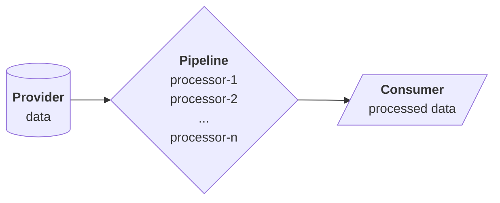
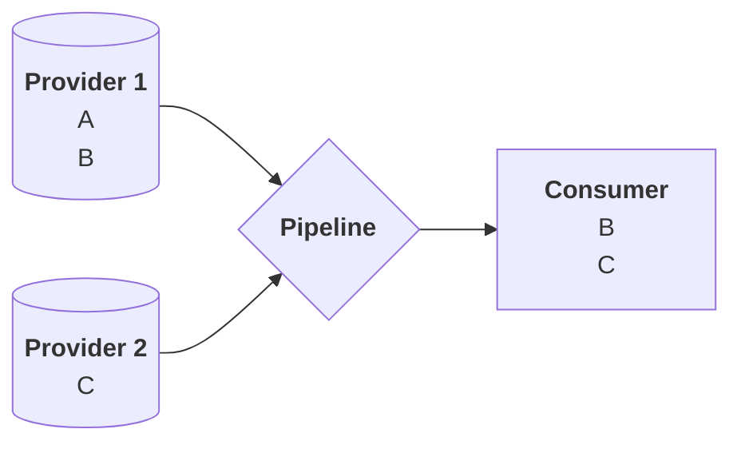
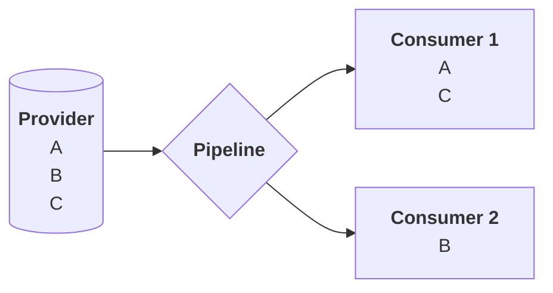
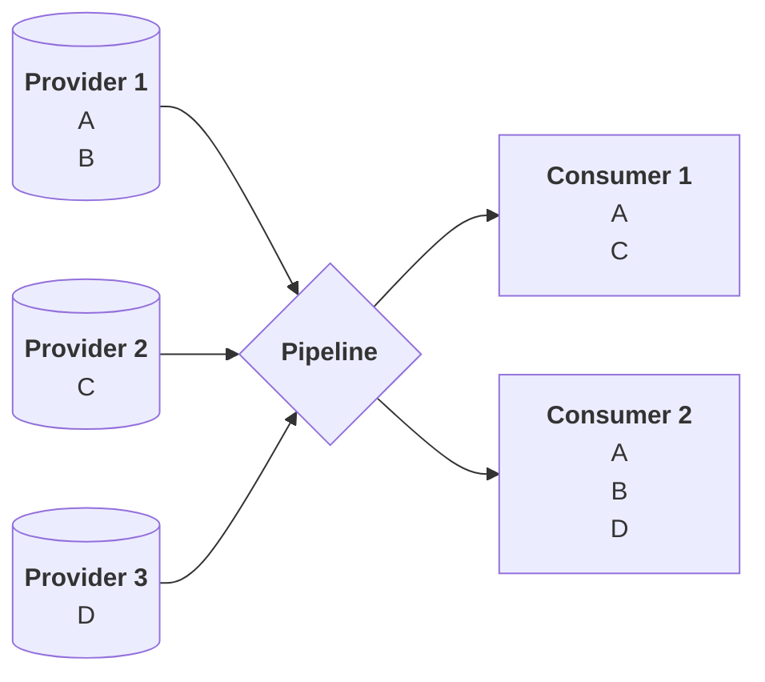
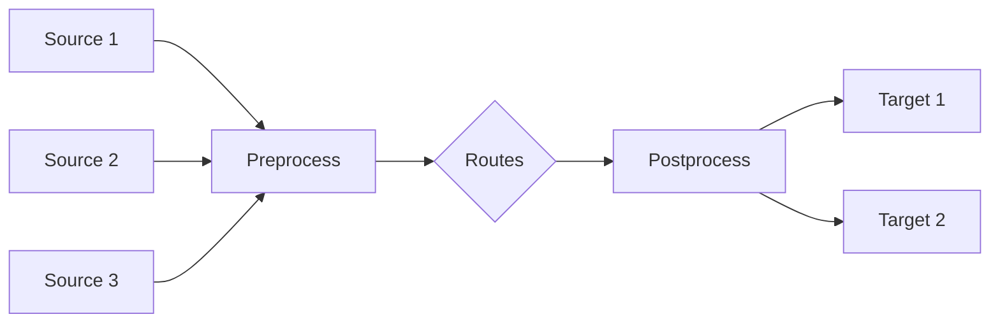
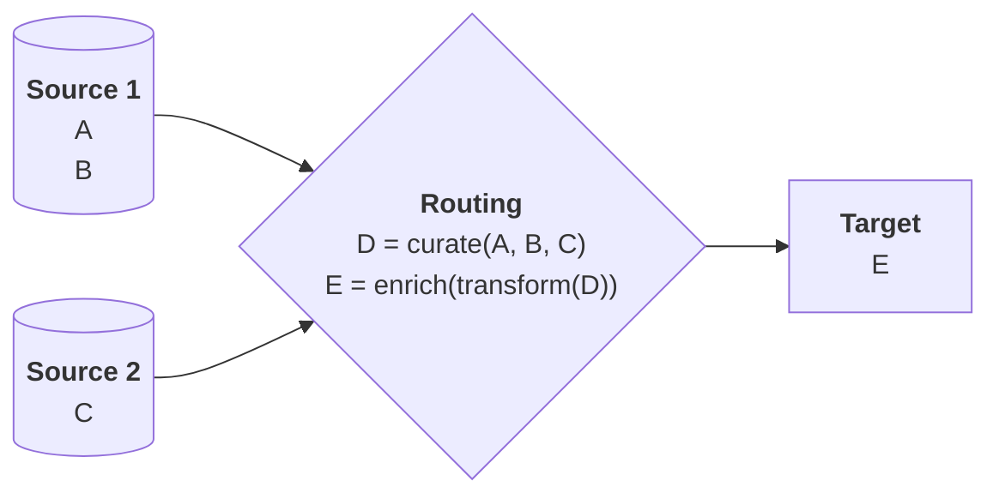

# Pipelines

**VirtualMetric DataStream** pipelines were designed to automate large-volume data processing. They can be used to extract values from various sources, transform or convert these values, enrich them by correlating them with other available information, and to forward them to various destinations for consumption. 

In short, they are aimed at helping you design and implement your telemetry workflow.

## Overview

A pipeline, in its simplest form, is a chain of processors that run sequentially, operating on the incoming data streamed from providers, and directing them to destinations for consumption.

The sources can be devices, networks, or other pipelines, and the targets can be consoles, files, storage systems, or other pipelines. Sources and targets can be connected to each other in _one-to-one_, _one-to-many_, _many-to-one_, and _many-to-many_ configurations.

Each incoming stream can be queried with criteria specific to the information contained therein, and each outgoing stream can be enriched with inferences made from correlations for use on the destination side.

Schematically:



In real life scenarious, the level of complexity of the configurations will vary based on the requirements of the consumers and the intended destinations.

## Discussion

A pipeline can consume data from multiple providers, and once it is finished processing them, can direct some or all of the processed data to a specific consumer in a _one-to-one_ scheme:



It can also consume data from a single provider and deliver the processed results to multiple consumers:



Finally&mdash;and possibly in most real-life scenarios&mdash;there may be multiple providers and consumers connected to each other in much more complex arrangements:



Effectively, each source may be the target of an upstream pipeline, and each target may serve as the source for a downstream one. The detail to keep in mind is that each provider side is delegating some processing to the next pipeline based on the established requirements of the consumer side. The pipeline is acting as the _middleman_ for the data interchange.

Even if the pipeline routes some of the data without any processing, this will be due to the demands of the consumer side, so the pipeline is still performing a meaningful role by forwarding the data as per the consumer's policy.

## Included Middle

Notwithstanding the above, there is also a middle stage&mdash;where most software solutions do their real work: **Routing**. However, this is a stage that in turn depends on two other interim stages that also act as consumers and providers, and these are the **Pre-processing** and **Post-processing** stages, respectively.

> As a side note, the implementation of these interim stages is based on a transformation known as [normalization](/configuration/pipelines/normalization.mdx), i.e. preparing the data for easier handling further down the chain.

Pipelines are, once again, our primary tool for implementing these interim stages. Schematically:



As can be seen, routes are right in the middle of this setup.

---

The purpose of the graphics provided above is to emphasize one thing: the primary purpose of pipelines is using _division of labor_ to simplify telemetry.

## Data Streams

In any telemetry operation, the incoming raw data streams will naturally have their own structure. However, this structure may not&mdash;and frequently _does not_&mdash;lend itself to use for some specific purpose. Trying to do so would be time consuming, processor-intensive, and possibly error prone. Therefore, it is unwise to implement a curation strategy on the source side, where the data originates.

Similarly, if the curated data needs to be transformed or enriched as per the requirements of a downstream consumer, it is unwise to try to delegate these transformation tasks to the target side where the data is expected to be in an easily consumable format.

And these are exactly the places where pipelines enter the picture.

## Divide and Rule

A pipeline is essentially based on the principle of _divide-and-rule_: divide the operations to be performed on the available data into the smallest meaningful and coherent actions, sequence them in a logical order based on the expected _inputs_ and _outputs_, and run them as a chain.

The basic layout of the configuration for a typical pipeline looks like so:

```yaml
pipeline:
  description: "What the pipeline does"
  processors:
   - processor-1:
      field: foo
      value: "A"
   - processor-2:
      description: "What processor-2 does"
      field: bar
      value: true
   - processor-3:
      field: baz
      value: 10
```

This pipeline is created based on the assumption that the incoming data stream will have the following structure:

```yaml
data:
  - foo: ["A", "B", "C", ...]
  - baz: [5, 10, 1, ...]
  - bar: true
```

Note that the pipeline definition contains a mixture of _required_ and _optional_ fields, and that&mdash;in this form&mdash;it disregards the order of fields in the source data. All that it cares about is that

* the enumerated fields exist, and
* they contain the expected types of data

## Simplified Functionality

The above pipeline may appear incomplete: it does _not_ explicitly specify what will happen to the selected values when the processors are run. Assume that, after this pipeline has been run, the data appears like so:

```yaml
data:
  - foo: ["Z", "B", "C", ...]
  - baz: [5, 100, 1, ...]
  -bar: true
```

One can easily notice that the value `A` in `foo` has become `Z`, that the `10` in `baz` has become `100`, whereas `bar` is left untouched since it was already `true`.

Although this pipeline may appear underspecified, the example is intended to illustrate that what a sequence of processors does can be as simple as this. Each processor performs a only single operation on a specific field, and that is the pipeline's power.

Once the incoming data is normalized&mdash;i.e. converted into a structure that makes it easy to extract items from it&mdash;it becomes very easy to curate, transform, and enrich its values into a desirable form on the fly.

This brings us to the concepts of _curation_, _transformation_, and _enrichment_.

## Streamlined Streams

As we have said earlier, the incoming data streams will have their own structure. As such, they will at best be only partially suitable for analysis and, later, decision making. In its raw form, data is frequently not&mdash;at least may not be&mdash;what it seems to be. It has to be sorted and sifted through to pick the relevant information from it.

The process of selecting or discarding items based on specific criteria is called _curation_. This involves checking whether a field's value matches or contains the values or fragments of values we are looking for.

After this, the remaining data may need to be converted into forms making them more suitable for analysis and use. This second phase is called _transformation_.

Finally, the data may contain hints or fragments of information which, when correlated with other available information, may yield insights that may be prerequisite to analysis and use. Adding correlated information in order to render the data more relevant&mdash;or increase its relevance&mdash;is known as _enrichment_.

The overall process can be represented schematically as:



It is through this type of seamless three-stage design that a pipeline truly shines and proves itself indispensible for telemetry.

---

## Configuration

The fields required to define pipelines are:

- `name`: Unique identifier
- `processors`: List of processors with their structures

Use the `name` of the pipeline to refer to it in your configurations.

**Example**:

```yaml
pipelines:
  - name: checkpoint
    processors:
      - grok:
          field: message
          patterns:
            - "%{COMMONAPACHELOG}"
      - set:
          field: event.provider
          value: "checkpoint"
```

This pipeline uses a `grok` processor with a pattern that extracts _Apache_ log data, and a `set` processor to write "`checkpoint`" to the `event.provider` field.

Pipelines can also access the _metadata_ of processors. These are:

* `tag`: Identifier used for logging/tracking processor execution
* `logEntry`: Log entry being processed
* `params`: Map of parameters available to scripts

The data these metatags provide depends on the context and the log format.

---

N E W

## Overview

Pipelines define a sequence of data processing operations that transform, enrich, and structure incoming log data. They serve as the central data transformation mechanism, applying processors in a specific order to normalize and enhance raw data.

## Pipeline Structure

A pipeline consists of a series of processors that are executed sequentially to transform data:

```yaml
pipelines:
  - id: apache_logs
    description: "Process Apache web server logs"
    processors:
      - grok:
          field: message
          patterns:
            - "%{COMMONAPACHELOG}"
      - date:
          field: timestamp
          formats:
            - "dd/MMM/yyyy:HH:mm:ss Z"
          target_field: "@timestamp"
      - rename:
          fields:
            - from: clientip
              to: source.ip
      - geoip:
          field: source.ip
          target_field: source.geo
```

## Configuration Parameters

Each pipeline definition includes the following parameters:

| Field | Required | Default | Description |
|-------|----------|---------|-------------|
| `id` | Y | | Unique identifier for the pipeline |
| `description` | N | | Optional explanation of the pipeline's purpose |
| `processors` | Y | | Ordered list of processors to execute |
| `if` | N | | Conditional expression to determine if pipeline should be applied |
| `on_failure` | N | | Processors to execute if the pipeline fails |
| `ignore_failure` | N | `false` | Continue pipeline execution despite processor failures |

## Processor Types

Pipelines can include various processor types to handle different data transformation needs:

| Processor | Purpose |
|-----------|---------|
| `append` | Adds values to array fields |
| `convert` | Changes field data types |
| `date` | Parses and normalizes date/time fields |
| `dissect` | Simple pattern-based extraction |
| `drop` | Removes documents based on conditions |
| `geoip` | Enriches IP addresses with geographic data |
| `grok` | Pattern matching and field extraction |
| `json` | Parses JSON strings into structured data |
| `kv` | Extracts key-value pairs from strings |
| `lowercase` | Converts string fields to lowercase |
| `remove` | Deletes specified fields |
| `rename` | Changes field names |
| `script` | Executes custom transformation logic |
| `set` | Creates or updates field values |
| `split` | Divides strings into arrays using delimiters |
| `uppercase` | Converts string fields to uppercase |

## Conditional Execution

Pipelines and processors support conditional execution using the `if` parameter:

```yaml
pipelines:
  - id: web_logs
    processors:
      - set:
          field: event.category
          value: web
          if: "ctx.source == 'apache' || ctx.source == 'nginx'"
      - geoip:
          field: client.ip
          target_field: client.geo
          if: "ctx?.client?.ip != null"
```

## Error Handling

Pipelines provide robust error handling with `on_failure` and `ignore_failure` options:

```yaml
pipelines:
  - id: critical_processing
    ignore_failure: false
    on_failure:
      - set:
          field: error.message
          value: "Pipeline processing failed: {{_ingest.on_failure_message}}"
      - set:
          field: event.outcome
          value: "failure"
```

## Pipeline Chaining

Pipelines can be chained together using routes or referenced in device configurations:

```yaml
# Reference in a device configuration
devices:
  - id: 1
    name: web_server_logs
    type: http
    pipelines:
      - common_enrichment
      - web_logs
    properties:
      port: 8080
```

## Common Patterns

### Log Parsing and Normalization

```yaml
pipelines:
  - id: syslog_parser
    description: "Parse and normalize syslog messages"
    processors:
      - grok:
          field: message
          patterns:
            - "%{SYSLOGLINE}"
      - date:
          field: timestamp
          target_field: "@timestamp"
          formats:
            - "MMM dd HH:mm:ss"
            - "MMM  d HH:mm:ss"
      - set:
          field: event.kind
          value: event
      - rename:
          fields:
            - from: program
              to: process.name
            - from: logsource
              to: host.hostname
```

### Field Enrichment

```yaml
pipelines:
  - id: security_enrichment
    description: "Enrich security events with additional context"
    processors:
      - geoip:
          field: source.ip
          target_field: source.geo
      - set:
          field: event.category
          value: security
      - script:
          lang: painless
          source: |
            if (ctx.source.ip.startsWith('10.') || 
                ctx.source.ip.startsWith('192.168.')) {
              ctx.source.type = 'internal';
            } else {
              ctx.source.type = 'external';
            }
```

### Data Transformation

```yaml
pipelines:
  - id: data_normalizer
    description: "Standardize field names and values"
    processors:
      - rename:
          fields:
            - from: src
              to: source.ip
            - from: dst
              to: destination.ip
      - convert:
          field: bytes
          type: long
      - script:
          lang: painless
          source: "ctx.network.bytes = ctx.bytes_in + ctx.bytes_out"
      - remove:
          field:
            - bytes_in
            - bytes_out
```

## Best Practices

1. **Start with Validation**: Begin pipelines with validation processors to ensure data quality
2. **Order Matters**: Arrange processors logically - extract fields before using them
3. **Use Conditionals**: Apply processors selectively to improve performance
4. **Handle Errors**: Configure appropriate error handling for critical pipelines
5. **Test Thoroughly**: Validate pipeline behavior with representative sample data
6. **Document Purpose**: Include descriptive comments to explain complex transformations
7. **Monitor Performance**: Watch for processor bottlenecks in high-volume environments

## Common Pipeline Combinations

| Use Case | Recommended Processors |
|----------|------------------------|
| Log Parsing | `grok` → `date` → `rename` → `remove` |
| Security Events | `kv` → `geoip` → `set` → `script` |
| API Data | `json` → `convert` → `rename` → `set` |
| CSV Processing | `csv` → `convert` → `rename` |
| Field Standardization | `rename` → `lowercase` → `set` |
