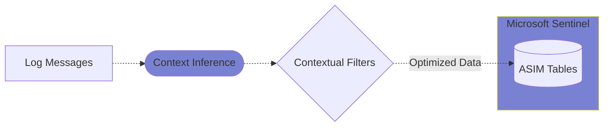

# Features

**VirtualMetric DataStream** offers a range of features that make it a powerful and flexible telemetry pipeline solution for Microsoft Sentinel and other Azure services. Enterprises can leverage these features to streamline their data collection, processing, and routing operations:

## Agentless Data Collection

**DataStream**'s agentless design enables data collection on many widely-used platforms without requiring third-party tools or complicated configurations. This significantly reduces operational overhead and eliminates common deployment challenges associated with traditional agent-based solutions.

The system operates through secure read-only connections to target systems using standard protocols. On **Windows** systems, it leverages Windows Remote Management (WinRM). On Unix-based systems including **Linux**, **macOS**, **Solaris**, and **AIX**, it utilizes SSH and native logging facilities to collect data securely.

The agentless approach also ensures that **DataStream** can begin collecting data immediately after configuration, without requiring system restarts or extensive installation management. This makes it particularly valuable for large enterprises where deploying and maintaining agents across thousands of systems is impractical.

The system leverages read-only user rights for secure remote access. By integrating with _Credential Stores_ and _Active Directory Service Accounts_, it eliminates the need for user credentials, simplifying creation of secure connections, and thereby ensuring data integrity and compliance.

Key benefits include:

* _Zero deployment overhead_ - no software installation required on target systems
* _Simplified maintenance_ - no agent updates or patches to manage
* _Cross-platform compatibility_ - works consistently across different operating systems
* _Minimal system footprint_ - uses native protocols and interfaces
* _Reduced attack surface_ - operates with read-only permissions
* _Enterprise-grade security_ - leverages existing authentication infrastructure

## Vectorized Processing Architecture

**DataStream**'s pipeline engine employs a sophisticated vectorized processing architecture that maximizes system resources by utilizing all available CPU cores. This design enables efficient processing of large log volumes and facilitates parallel data ingestion with multiple target SIEMs simultaneously.

The vectorized architecture breaks down incoming log streams into optimized chunks that can be processed independently across multiple cores. This parallelization ensures that system resources are used efficiently, preventing bottlenecks that commonly occur in single-threaded processing systems.

Each processing core operates independently on its assigned data chunk, performing tasks such as parsing, filtering, and enrichment. This parallel processing approach significantly reduces the overall processing time and enables real-time data handling even under heavy loads.

With over _10 times_ the ingestion speed of traditional solutions, **DataStream** reduces bandwidth usage down to the bare minimum, delivering significant cost savings. The high-performance architecture ensures that data is processed and delivered to target systems with minimal latency.

Key advantages include:

* _Maximum resource utilization_ - efficiently uses all available CPU cores
* _Parallel data processing_ - handles multiple data streams simultaneously
* _High-throughput ingestion_ - processes large volumes of logs in real-time
* _Scalable performance_ - processing capacity scales with available cores
* _Low latency_ - minimizes delay between data collection and delivery
* _Resource optimization_ - intelligent workload distribution across cores
* _Multi-target support_ - concurrent data delivery to multiple SIEM platforms

The architecture also includes built-in load balancing capabilities, automatically distributing workloads across available cores based on system metrics and processing demands. This ensures optimal performance as data volumes fluctuate throughout the day.

## Lossless Pipeline Engine

Our _Write-Ahead Log_ (WAL) architecture provides a robust foundation for data integrity by securely storing all routing and pipeline states on disk. This architecture ensures that every piece of data is safely persisted before processing, creating a reliable recovery point in case of system failures or unexpected shutdowns.

The WAL implementation in DataStream operates as a high-performance buffer between data collection and processing stages. When data arrives, it is immediately written to the WAL before any processing begins, creating a durable record of all incoming information. This approach guarantees that no data is lost during pipeline processing or system transitions.

Unlike solutions that require additional components like Kafka, **DataStream** caps log duplication at just one message. This ensures zero data loss, even in the event of a crash, while maintaining efficient storage utilization. The system achieves this through a sophisticated checkpoint mechanism that tracks the processing state of each message.

The _WAL_ approach also minimizes the risk of system downtime, ensuring that your telemetry pipeline is always up and running, and consistent, even under heavy loads. When the system restarts after an interruption, it can seamlessly resume processing from the last recorded state without data loss or duplication.

Key features include:

* _Zero data loss guarantee_ - all data is persisted before processing
* _Minimal message duplication_ - maximum of one copy per message
* _Automatic crash recovery_ - seamless resumption after system interruptions
* _State preservation_ - maintains pipeline and routing states on disk
* _High throughput_ - efficient write-ahead logging with minimal overhead
* _System consistency_ - ensures data integrity across pipeline stages
* _Resource efficiency_ - optimized storage utilization without external dependencies

The lossless architecture is particularly valuable in environments where data completeness is critical, such as security monitoring, compliance reporting, and audit trails. By ensuring that no data is lost during collection and processing, DataStream provides a reliable foundation for these essential business functions.

## Datasets and RBAC Structure

We are revolutionizing the traditional concept of _source_ in telemetry pipelines with our introduction of _Datasets_. This innovative approach transforms how telemetry data is organized, accessed, and secured throughout the entire pipeline process.

DataStream's Dataset architecture provides a sophisticated categorization system that organizes telemetry data at the source level. This categorization happens before data enters the processing pipeline, enabling granular control over data access and processing paths. The system automatically classifies incoming data into logical groups such as Security Events, Audit Events, System Events, and Application Events.

Unlike other solutions that focus solely on data collection via protocols or third-party agents, _Datasets_ categorize telemetry data&mdash;i.e. Windows Event Logs, Windows User Activity, Linux Audit Logs, etc.&mdash;at the source, simplifying pipeline design and enabling advanced _Role-Based Access Control_ (RBAC). This early categorization ensures that data is properly classified and secured from the moment it enters the system.

With _Datasets_, users can define role-based access at the data level to ensure that the teams working on the same source are fully isolated from each other. This innovative approach delivers greater flexibility and tighter security. For example, the SOC team can access security-related events while the Audit team works with compliance-related data, all without interference or overlap.

Key benefits include:

* _Granular access control_ - precise data access management at the dataset level
* _Team isolation_ - complete separation between different team workspaces
* _Simplified compliance_ - easier implementation of regulatory requirements
* _Flexible categorization_ - adaptable dataset definitions based on business needs
* _Efficient data routing_ - automated routing based on dataset classifications
* _Enhanced security_ - reduced risk of unauthorized data access
* _Streamlined management_ - centralized control over data access and distribution

The Dataset architecture also supports dynamic data routing, allowing organizations to define sophisticated processing rules based on dataset categories. This ensures that data not only reaches the right teams but also undergoes appropriate processing and enrichment before reaching its final destination in the SIEM platform.

## Dedicated Storage Format

The _VirtualMetric File Format_ (VMF) was engineered specifically for high-performance pipeline engines. It represents a significant advancement in log data storage and processing, building upon the foundations of Apache Avro while addressing its limitations for telemetry data handling.

VMF combines the efficiency of a row-based format with sophisticated data organization capabilities, enabling it to handle massive volumes of small data chunks efficiently. This hybrid approach provides optimal performance for both sequential processing and random access patterns, making it uniquely suited for telemetry data management.

With its roots in Apache Avro, VMF overcomes the limitations of Avro OCF through innovative features designed specifically for telemetry data.

Key features include:

* _Advanced Compression_ - achieves up to 99% compression ratio, optimized for both storage efficiency and quick access, intelligent compression selection based on data patterns, minimal CPU overhead during compression/decompression
* _Zero Trust Storage_ - end-to-end encryption of stored data, cryptographic verification of data integrity, access control integrated at the storage level, secure key management and rotation
* _Bloom Filters_ - rapid search capabilities across large datasets, efficient index management, minimized false positive rates, optimized memory usage for filter operations
* _Log Chaining_ - cryptographic linking of sequential log entries, tamper-evident log storage, verifiable audit trails, guaranteed log sequence integrity
* _TSA Integration_ - time-stamped authority integration, certified temporal proof of log existence, compliance with regulatory requirements, non-repudiation of log timestamps

The format's design enables disk-level merging without consuming system resources, making it highly efficient for large-scale data operations. This capability is particularly valuable in high-throughput environments where traditional formats would create significant system overhead.

VMF's comprehensive feature set makes it the ideal choice for organizations requiring high-performance, secure, and compliant log data handling. Whether the priority is storage efficiency, search performance, or forensic integrity, VMF provides the necessary capabilities out of the box.

## Advanced Data Routing

We have simplified data routing with our advanced `reroute` processor, eliminating the need for manual filtering that is necessary in other solutions. This innovative approach transforms complex routing scenarios into manageable, automated workflows that significantly reduce operational overhead.

The reroute processor operates at multiple levels of abstraction, allowing for both broad and granular control over data flow. At the pipeline level, it handles the overall flow of data between major system components, while at the content pack level, it manages specific data transformations and routing rules for different types of content.

This processor allows users to route data to destinations at the pipeline or content pack level. Advanced filters can be applied for precise data routing, and the _Dataset_ concept further streamlines this by enabling multiple data sources to coalesce around a single SIEM endpoint. The result is a more efficient and maintainable routing infrastructure that adapts to changing requirements.

Key capabilities include:

* _Multi-level Routing Control_ - pipeline-level traffic management, content pack-specific routing rules, conditional routing based on data attributes, dynamic destination selection
* _Advanced Filtering_ - complex condition evaluation, pattern matching and regular expressions, metadata-based filtering, content-aware routing decisions
* _Dataset Coalescing_ - unified endpoint management, intelligent data aggregation, optimized bandwidth utilization, reduced endpoint complexity
* _Scalability Features_ - horizontal scaling support, load-balanced routing, automatic failover, high-availability design

The reroute processor's sophisticated architecture enables organizations to design efficient and scalable routing strategies with ease. By automating complex routing decisions and providing flexible configuration options, it significantly reduces the operational burden of managing large-scale data flows while ensuring optimal data delivery to target systems.

## Extensive Processor Support

Our pipeline engine adopts the widely recognized Elastic Ingest Pipeline format, allowing IT and Security Engineers to create and manage pipelines effortlessly. This adoption of a familiar standard significantly reduces the learning curve while providing powerful data processing capabilities through a comprehensive set of built-in processors.

The pipeline architecture is designed with flexibility and ease of use in mind, offering both low-code and no-code options for pipeline configuration. This approach makes it accessible to team members with varying levels of technical expertise while maintaining the power and flexibility needed for complex data processing scenarios.

With 65+ processors, **DataStream** has the most comprehensive support in the industry for _low-code_/_no-code_ management enabling tasks like parsing, filtering, enrichment, routing, and more. Engineers with **Elastic** experience can leverage this robust and flexible pipeline engine, reducing onboarding time and enhancing operational efficiency.

Key capabilities include:

* _Data Parsing_ - structured log parsing, JSON/XML processing, CSV handling, regular expressions for extraction, custom format support
* _Filtering Operations_ - content-based filtering, metadata filtering, conditional processing, pattern matching, threshold-based filtering
* _Data Enrichment_ - metadata addition, field transformation, lookup table integration, geolocation enrichment, threat intelligence correlation
* _Advanced Processing_ - data aggregation, statistical analysis, machine learning integration, complex event processing, custom script execution

The extensive processor library enables organizations to implement sophisticated data processing workflows without extensive coding or development effort. Each processor is designed with both performance and usability in mind, providing powerful capabilities while maintaining ease of configuration and management.

## Microsoft Sentinel Integration

The pipeline engine was specifically crafted to integrate seamlessly with Microsoft Sentinel, providing a sophisticated integration layer that understands and optimizes data flow into Sentinel's Advanced Security Information Model (ASIM) structure. This native integration eliminates the complexity typically associated with Sentinel data ingestion and normalization.

Our integration approach focuses on intelligent context inference, automatically analyzing incoming log messages to determine their security context and relevance. This automated classification ensures that data is properly categorized and routed to the appropriate ASIM tables without manual intervention.

By inferring context from log messages, our solution automatically ingests data into the appropriate ASIM tables, drastically reducing the manual effort and accelerating integration. This intelligent mapping ensures that security events are properly normalized and enriched before reaching Sentinel's analytics engine.

Key features include:

* _Intelligent Context Inference_ - automatic event classification, smart field mapping, metadata enrichment, relationship detection, pattern recognition
* _ASIM-Optimized Processing_ - native ASIM table mapping, schema validation, field normalization, data type conversion, relationship preservation
* _Cost Reduction_ - smart data filtering, deduplication, agregation options, volume optimization,  ingestion rate control
* _Performance Enhancement_ - parallel processing, batch optimization, connection pooling, buffer management, rate limiting

With contextual filters, users can easily optimize data ingestion to ensure only relevant information is sent to Sentinel, saving time and reducing costs by increasing efficiency. The system's intelligent filtering capabilities help organizations maintain high-quality security data while minimizing storage and processing overhead in their Sentinel deployment.

---

Whatever your telemetry needs, **DataStream** has something to offer to make your operations much more robust, secure, streamlined, and efficient at drastically reduced costs.

---
