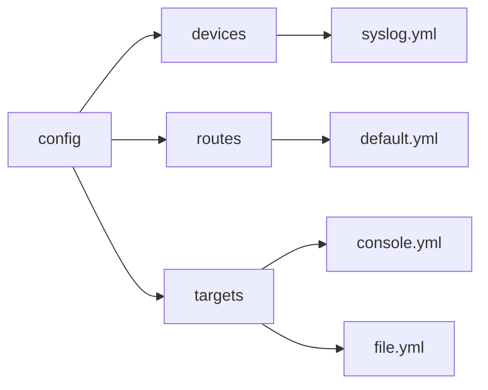

# Getting Started: Management

Management of **VirtualMetric Director** telemetry processes is done through configuration files in YAML format. In this chapter, we will give a brief summary of how these files are used and the minimum configurations required.

## Configuration Files

The configurations may be placed in separate files or they may be grouped together based on your telemetry operation requirements.

By default, configuration files reside in the directories under the `config` folder and have a `.yml` extension:



You can place your files anywhere you wish under `config` since **Director** discovers them by traversing the subdirectories recursively.

## Devices

Devices are data sources that collect or receive telemetry data. The required fields are:

- `id`: Unique numeric identifier
- `name`: Descriptive name
- `type`: Device type (e.g. `http`, `tcp`, `udp`, `syslog`, `estreamer`, `azmon`, `windows`)
- `properties`: Type-specific configuration settings

Use the `id` of the device to refer to it in your configurations.

**Example**:

```yaml
  id: 1
  type: http
  properties:
    port: 8080
    content_type: "application/json"
```

You can organize your device files in two ways:

- Using standalone files

    <Tabs groupId="cli-options">
      <TabItem value="powershell" label="PowerShell" default>
        ```PowerShell
        C:\Users\<user-name>\Documents\syslog.yml
        ```
      </TabItem>
      <TabItem value="bash" label="Bash">  
        ```bash
        ~: syslog.yml
        ```
      </TabItem>
    </Tabs>

- Using listener-based groupings:

    <Tabs groupId="cli-options">
      <TabItem value="powershell" label="PowerShell" default>
        ```PowerShell
        C:\path\to\<vm_root>\listeners\syslog.yml
        ```
      </TabItem>
      <TabItem value="bash" label="Bash">  
        ```bash
        ~ ./path/to/<vm_root>/listeners/syslog.yml
        ```
      </TabItem>
    </Tabs>

Choose the one that best fits your needs.

:::tip
Each device type provides specific options detailed in its respective [chapter](/docs/configuration/devices/index.mdx).
:::

For a general discussion, see the [overview](/docs/configuration/devices/index.mdx).

## Targets

Targets define destinations where processed data is sent. The required fields are:

- `name`: Unique identifier
- `type`: Target type (destination system)
- `properties`: Type-specific configuration (connection details, authentication, etc.)

Use the `name` of the target to refer to it in your configurations.

**Example**:

```yaml
- name: elasticsearch
  type: elasticsearch
  properties:
    hosts: ["http://elasticsearch:9200"]
    index: "logs-%{+yyyy.MM.dd}"
    username: "elastic"
    password: "${ES_PASSWORD}"
```

Your target files can be named as, e.g.

* `<vm_root>/config/target.yml`
* `<vm_root>/config/targets/outputs.yml`
* `<vm_root>/config/targets/outputs/sentinel.yml`

As the nesting level increases, file names become more specific, offering additional context for classification. Select the organizational method that best meets your requirements.

:::tip
Each target type provides specific options detailed in its respective [chapter](/docs/configuration/targets/index.mdx).
:::

Multiple targets can be used for redundancy, [normalization](/docs/configuration/pipelines/normalization.mdx) rules can be implemented, and alerts can be put in place for notifications and error handling.

For a general discussion, see the [overview](/docs/configuration/targets/index.mdx).

## Pipelines

Pipelines define data processing workflows with processors that transform and enrich data. The required fields are:

- `name`: Unique identifier
- `processors`: List of processors with their configurations

Use the `name` of the pipeline to refer to it in your configurations.

**Example**:

```yaml
- name: checkpoint
  processors:
    - grok:
      field: message
      patterns:
        - "%{COMMONAPACHELOG}"
    - set:
      field: event.provider
      value: "checkpoint"
```

Pipelines can also access metadata available in processors. These are:

* `ctx`: Processing context
* `logEntry`: Log entry being processed
* `tag`: Identifier used for logging/tracking processor execution
* `params`: Map of parameters available to scripts

{/* TODO: Enlist */}

For a general discussion, see the [overview](/docs/configuration/pipelines/index.mdx).

## Routes

Routes define the flow of data from devices through pipelines to targets. The required fields are:

- `devices`: List of device IDs or patterns that match source devices
- `targets`: List of target IDs where data should be sent
- `pipelines`: (Optional) List of pipeline IDs for data processing

The enlisted devices, targets, and pipelines must be pre-configured to be usable by routes. Use their ids or names to refer to them.

**Example**:

```yaml
- devices: ["syslog_*"]
  pipelines: ["normalize", "enrich"]
  targets: ["elasticsearch", "s3_backup"]
```

## Streamlining

When dealing with your configurations, you can use:

* **Environment Variables**:

  Use `${ENV_VAR}` syntax to reference environment variables:

  ```yaml
  password: "${ES_PASSWORD}"
  ```

  For a general discussion, see the [overview](/docs/configuration/routes/index.mdx).

* **Conditional Logic**:

  Some components support conditional execution where an `if` clause that serves as the selector directs the data to a processor such as `set`:

  ```yaml
  - if: '{{event.type}} == "error"'
    set:
      field: alert.level
      value: high
  ```

* **Templates**:

  Use mustache-style templates to reference field values:

  ```yaml
  - set:
    field: user.full_name
    value: "{{user.first_name}} {{user.last_name}}"
  ```
