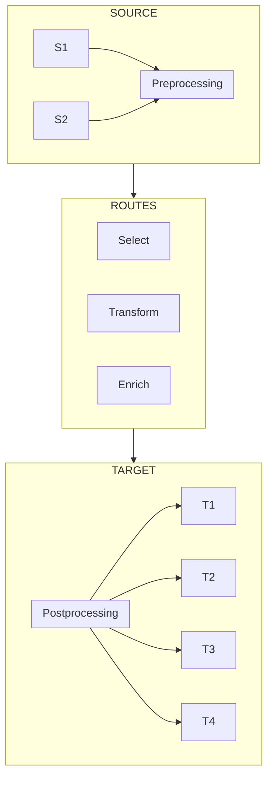

import Mermaid from '@theme/Mermaid';

# Diagrams

The following diagrams were drawn with [Mermaid](https://mermaid.js.org/):

### Boxes

<Mermaid
  value={`graph TD;
    A-->B;
    A-->C;
    B-->D;
    C-->D;`}
/>

### Flow Charts

### Class Hierarchies

## Nested Boxes

