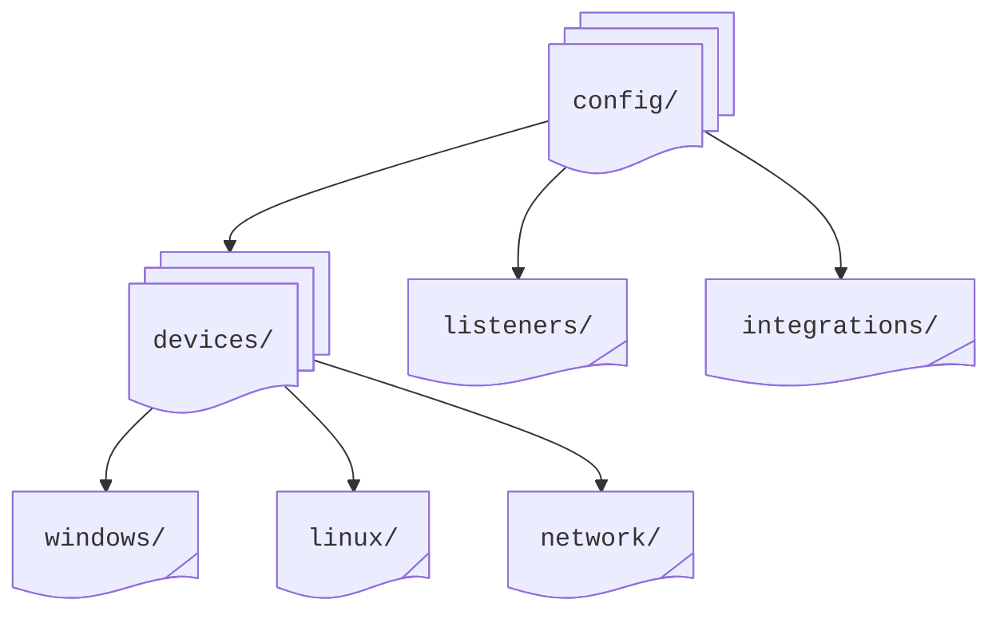

# Devices: Quick Start

This guide will walk you through configuring your first device in **Director** using a syslog server for illustration.

## Configuration

The user has the flexibility to organize the device configuration files as they wish using the files with a `.yml` extension that reside inside the `config` directory:



**Director** discovers all the configuration files regardless of the subfolder structure by scanning the `<vm_root>/config` directory recursively. You can organize your configurations in two ways:

<Tabs groupId="cli-options">
  <TabItem value="powershell" label="PowerShell" default>
  Using the `.yml` extension as a standalone file&hellip;
  
  ```PowerShell
    C:\Users\<user-name>\Documents\syslog.yml
  ```

  -or- with a listener-based grouping:
  
  ```PowerShell
    C:\<vm_root>\listeners\syslog.yml
  ```
  </TabItem>
  <TabItem value="bash" label="Bash">
  Using the `.yml` extension as a standalone file&hellip;

  ```bash
    ~: syslog.yml
  ```

  -or- with a listener-based grouping:
  
  ```bash
  ~: <vm_root>/listeners/syslog.yml
  ```
  </TabItem>
</Tabs>

Choose the grouping that best fits your needs.

## Basic UDP Setup

### 1. Create The Configuration File

Create a syslog configuration in your preferred location (e.g. `config/devices/syslog.yml`):

```yaml
- id: 1
  name: syslog_udp
  type: syslog
  properties:
    protocol: udp
    address: 0.0.0.0
    port: 514
```

### 2. Test The Configuration

You can test the configuration using either **Director**'s cross-platform companion **Generator** or traditional tools:

<Tabs>
  <TabItem value="windows" label="Windows" default>
    Using **VirtualMetric Generator**

    ```powershell
    vmetric-generator -mode=syslog -address=127.0.0.1:514 -message="Test Message"
    ```
  </TabItem>

  <TabItem value="linux" label="Linux">
    Using **VirtualMetric Generator**

    ```bash
    vmetric-generator -mode=syslog -address=127.0.0.1:514 -message="Test Message"
    ```

    Using **System Logger**

    ```bash
    logger -n 127.0.0.1 -P 514 "Test message"
    ```
  </TabItem>

  <TabItem value="macos" label="macOS">
    Using **System Logger**

    ```bash
    logger -n 127.0.0.1 -P 514 "Test message"
    ```
  </TabItem>
</Tabs>

## Secure TCP Setup

### 1. Prepare TLS Certificates

<Tabs>
  <TabItem value="windows" label="Windows" default>
    Using **VirtualMetric Director**

    ```powershell
    vmetric-director -pfx2pem=./cert-file.pfx # Windows
    ```
  </TabItem>

  <TabItem value="linux" label="Linux">
  Using **VirtualMetric Director**

  ```bash
  vmetric-director -pfx2pem=./cert-file.pfx
  ```
  
  Using **OpenSSL**
  ```bash
  openssl genrsa -out server.key 2048
  openssl req -new -x509 -key server.key -out server.crt -days 365
  ```
  </TabItem>

  <TabItem value="macos" label="macOS">
  Using **VirtualMetric Director**

  ```bash
  vmetric-director -pfx2pem=./cert-file.pfx
  ```
  
  Using **OpenSSL**
  ```bash
  openssl genrsa -out server.key 2048
  openssl req -new -x509 -key server.key -out server.crt -days 365
  ```
  </TabItem>
</Tabs>

This generates the `key.pem` and `cert.pem` files.

:::warning
Always use TLS encryption in production environments, especially over untrusted networks. Ensure proper file permissions are set on certificate files:
- Private key (`key.pem`) should be readable only by the Director process
- Certificate file (`cert.pem`) can be world-readable
:::

### 2. Create Secure Configuration

Update or create your configuration file, e.g. `config/devices/secure_syslog.yml`:

```yaml
- id: 2
  name: syslog_secure
  type: syslog
  properties:
    protocol: tcp
    address: 0.0.0.0
    port: 6514
    tls:
      status: true
      cert_name: cert.pem
      key_name: key.pem
    framing: octet
    max_connections: 1000
    timeout: 300
    batch_size: 5000
    queue:
      interval: 2
```

:::note
The `cert.pem` and `key.pem` are generated via `pfx2pem`.
:::

### 3. Place TLS Certificates

Copy the certificate files to your **Director** root directory:

<Tabs>
  <TabItem value="windows" label="Windows" default>
  ```powershell
  cp cert.pem key.pem <vm_root>/
  ```
  </TabItem>
  
  <TabItem value="linux" label="Linux" default>
  ```bash
  cp cert.pem key.pem <vm_root>/
  ```
  </TabItem>

  <TabItem value="macos" label="macOS" default>
  ```bash
  cp cert.pem key.pem <vm_root>/
  ```
  </TabItem>
</Tabs>

### 4. Test Secure Configuration

Test the secure connection:

<Tabs>
  <TabItem value="windows" label="Windows" default>
  ```powershell
  echo "Test secure message" | openssl s_client -connect 127.0.0.1:6514
  ```
  </TabItem>
  
  <TabItem value="linux" label="Linux" default>
  ```bash
  echo "Test secure message" | openssl s_client -connect 127.0.0.1:6514
  ```
  </TabItem>

  <TabItem value="macos" label="macOS" default>
  ```bash
  echo "Test secure message" | openssl s_client -connect 127.0.0.1:6514
  ```
  </TabItem>
</Tabs>

## Performance Tuning

For high-volume environments, add the following to your configuration:

```yaml
  reuse: true
  workers: 4
  buffer_size: 32768
  flush_interval: 5
```

## Monitoring

Check **Director**'s logs for success messages on launching and initialization, connection acceptance, and configuration validation.

:::tip
Worker counts, buffer sizes, and batch settings can be adjusted based on your message volume.
:::

## Next Steps

Configure and use message forwarding, advanced authentication options, and pipelines.
